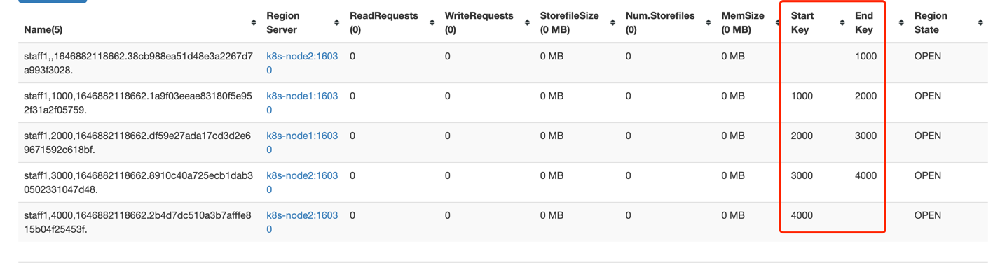
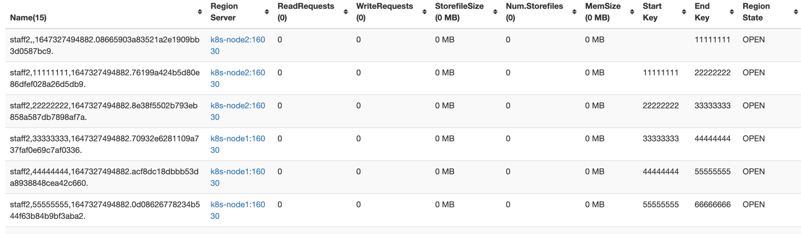

1:预分区

        每一个region维护着startRow与endRowKey，如果加入的数据符合某个region维护的rowKey范围，则该数据交给这个region维护。那么依照这个原则，我们可以将数据所要投放的分区提前大致的规划好，以提高HBase性能。
    
2:手动设定预分区(5个分区)

        hbase> create 'staff1','info','partition1',SPLITS => ['1000','2000','3000','4000']

3: 生成16近制序列预分区

    create 'staff2','info','partition2',{NUMREGIONS => 15, SPLITALGO => 'HexStringSplit'}

    rowkey 要是16近制

4: 按照文件中设置的规则预分区

    创建splits.txt文件内容如下：
    aaaa
    bbbb
    cccc
    dddd

    然后执行create 'staff3','partition3',SPLITS_FILE => 'splits.txt'
