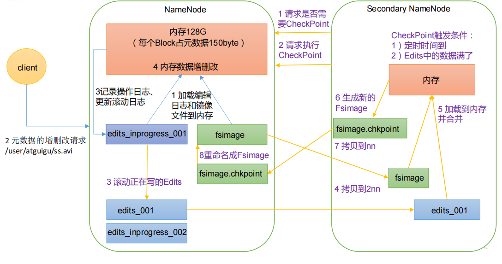

1) NN 和 2NN 工作机制
    
        思考：NameNode 中的元数据是存储在哪里的？
        首先，我们做个假设，如果存储在 NameNode 节点的磁盘中，因为经常需要进行随机访
        问，还有响应客户请求，必然是效率过低。因此，元数据需要存放在内存中。但如果只存在
        内存中，一旦断电，元数据丢失，整个集群就无法工作了。因此产生在磁盘中备份元数据的
        FsImage。
        这样又会带来新的问题，当在内存中的元数据更新时，如果同时更新 FsImage，就会导
        致效率过低，但如果不更新，就会发生一致性问题，一旦 NameNode 节点断电，就会产生数
        据丢失。因此，引入 Edits 文件（只进行追加操作，效率很高）。每当元数据有更新或者添
        加元数据时，修改内存中的元数据并追加到 Edits 中。这样，一旦 NameNode 节点断电，可
        以通过 FsImage 和 Edits 的合并，合成元数据。
        但是，如果长时间添加数据到 Edits 中，会导致该文件数据过大，效率降低，而且一旦
        断电，恢复元数据需要的时间过长。因此，需要定期进行 FsImage 和 Edits 的合并，如果这
        个操作由NameNode节点完成，又会效率过低。因此，引入一个新的节点SecondaryNamenode，
        专门用于 FsImage 和 Edits 的合并。
    
   
   
   1） 第一阶段：NameNode 启动
   
       （1）第一次启动 NameNode 格式化后，创建 Fsimage 和 Edits 文件。如果不是第一次启动，直接加载编辑日志和镜像文件到内存。
       （2）客户端对元数据进行增删改的请求。 
       （3）NameNode 记录操作日志，更新滚动日志。 
       （4）NameNode 在内存中对元数据进行增删改。
       
   2）第二阶段：Secondary NameNode 工作
   
       （1）Secondary NameNode 询问 NameNode 是否需要 CheckPoint。直接带回 NameNode是否检查结果。
       （2）Secondary NameNode 请求执行 CheckPoint。 
       （3）NameNode 滚动正在写的 Edits 日志。 
       （4）将滚动前的编辑日志和镜像文件拷贝到 Secondary NameNode。
       （5）Secondary NameNode 加载编辑日志和镜像文件到内存，并合并。
       （6）生成新的镜像文件 fsimage.chkpoint。
       （7）拷贝 fsimage.chkpoint 到 NameNode。 
       （8）NameNode 将 fsimage.chkpoint 重新命名成 fsimage。
       
2)  Fsimage 和 Edits 解析
    
        NameNode被格式化之后，将在/software/hadoop-3.1.3/data/dfs/name/current 目录中产生如下文件
        
        -rw-r--r-- 1 root root     379 Jan 24 22:42 edits_0000000000000000001-0000000000000000005
        -rw-r--r-- 1 root root 1048576 Jan 24 22:42 edits_0000000000000000006-0000000000000000006
        -rw-r--r-- 1 root root      42 Jan 24 22:45 edits_0000000000000000007-0000000000000000008
        -rw-r--r-- 1 root root 1048576 Jan 24 22:50 edits_0000000000000000009-0000000000000000015
        -rw-r--r-- 1 root root      42 Jan 24 23:14 edits_0000000000000000016-0000000000000000017
        -rw-r--r-- 1 root root 1048576 Jan 24 23:14 edits_0000000000000000018-0000000000000000018
        -rw-r--r-- 1 root root      42 Jan 24 23:18 edits_0000000000000000019-0000000000000000020
        -rw-r--r-- 1 root root 1048576 Jan 24 23:18 edits_0000000000000000021-0000000000000000021
        -rw-r--r-- 1 root root      42 Jan 24 23:25 edits_0000000000000000022-0000000000000000023
        -rw-r--r-- 1 root root 1048576 Jan 24 23:25 edits_0000000000000000024-0000000000000000024
        -rw-r--r-- 1 root root      42 Jan 24 23:29 edits_0000000000000000025-0000000000000000026
        -rw-r--r-- 1 root root 1048576 Jan 24 23:29 edits_0000000000000000027-0000000000000000027
        -rw-r--r-- 1 root root 1048576 Jan 25 22:00 edits_0000000000000000028-0000000000000000028
        -rw-r--r-- 1 root root 1048576 Jan 25 22:23 edits_0000000000000000029-0000000000000000134
        -rw-r--r-- 1 root root   10509 Jan 25 22:58 edits_0000000000000000135-0000000000000000218
        -rw-r--r-- 1 root root 1048576 Jan 25 22:58 edits_0000000000000000219-0000000000000000219
        -rw-r--r-- 1 root root 1048576 Jan 26 22:14 edits_0000000000000000220-0000000000000000425
        -rw-r--r-- 1 root root 1048576 Jan 26 22:32 edits_0000000000000000426-0000000000000000426
        -rw-r--r-- 1 root root      42 Jan 26 22:39 edits_0000000000000000427-0000000000000000428
        -rw-r--r-- 1 root root 1048576 Jan 26 22:39 edits_0000000000000000429-0000000000000000429
        -rw-r--r-- 1 root root     197 Jan 27 20:53 edits_0000000000000000430-0000000000000000433
        -rw-r--r-- 1 root root     286 Jan 27 21:53 edits_0000000000000000434-0000000000000000439
        -rw-r--r-- 1 root root 1048576 Jan 27 21:58 edits_0000000000000000440-0000000000000000449
        -rw-r--r-- 1 root root      42 Jan 28 20:34 edits_0000000000000000450-0000000000000000451
        -rw-r--r-- 1 root root    4146 Jan 28 21:34 edits_0000000000000000452-0000000000000000503
        -rw-r--r-- 1 root root     379 Jan 28 22:34 edits_0000000000000000504-0000000000000000509
        -rw-r--r-- 1 root root 1048576 Jan 28 22:34 edits_0000000000000000510-0000000000000000510
        -rw-r--r-- 1 root root 1048576 Jan 29 22:38 edits_inprogress_0000000000000000511
        -rw-r--r-- 1 root root    3832 Jan 28 22:34 fsimage_0000000000000000509
        -rw-r--r-- 1 root root      62 Jan 28 22:34 fsimage_0000000000000000509.md5
        -rw-r--r-- 1 root root    3832 Jan 29 22:38 fsimage_0000000000000000510
        -rw-r--r-- 1 root root      62 Jan 29 22:38 fsimage_0000000000000000510.md5
        -rw-r--r-- 1 root root       4 Jan 29 22:38 seen_txid
        -rw-r--r-- 1 root root     220 Jan 29 22:38 VERSION

        edits_inprogress_0000000000000000511 表示当前正在写的edits,如果满了就会滚动成
        edits_0000000000000000511
        生成新的edits_inprogress_0000000000000000512

        
        （1）Fsimage文件：HDFS文件系统元数据的一个永久性的检查点，其中包含HDFS文件系统的所有目录和文件inode的序列化信息。 
        （2）Edits文件：存放HDFS文件系统的所有更新操作的路径，文件系统客户端执行的所有写操作首先会被记录到Edits文件中。 
        （3）seen_txid文件保存的是一个数字，就是最后一个edits_的数字
        （4）每 次NameNode启动的时候都会将Fsimage文件读入内存，加 载Edits里面的更新操作，保证内存
        中的元数据信息是最新的、同步的，可以看成NameNode启动的时候就将Fsimage和Edits文件进行了合并。
   
3) oiv 查看 Fsimage 文件

    （1）查看 oiv 和 oev 命令
    （2）基本语法
    
            hdfs oiv -p 文件类型 -i 镜像文件 -o 转换后文件输出路径
            
    （3）案例实操
    
            hdfs oiv -p XML -i fsimage_0000000000000000510 -o /software/hadoop-3.1.3/fsimage.xml
            
            cat /software/hadoop-3.1.3/fsimage.xml
            
            思考：可以看出，Fsimage 中没有记录块所对应 DataNode，为什么？
            在集群启动后，要求 DataNode 上报数据块信息，并间隔一段时间后再次上报。
            
4) oev 查看 Edits 文件
    
    1) 基本语法
    
        hdfs oev -p 文件类型 -i 编辑日志 -o 转换后文件输出路径
    
    2) 案例实操
        
         hdfs oev -p XML -i edits_inprogress_0000000000000000514 -o /software/hadoop-3.1.3/edits.xml
         
          cat /software/hadoop-3.1.3/edits.xml
    
5)  CheckPoint 时间设置
    
    1）通常情况下，SecondaryNameNode 每隔一小时执行一次。
    
        [hdfs-default.xml]
        
        <property>
         <name>dfs.namenode.checkpoint.period</name>
         <value>3600s</value>
        </property>
        
    2）一分钟检查一次操作次数，当操作次数达到 1 百万时，SecondaryNameNode 执行一次
    
        <property>
             <name>dfs.namenode.checkpoint.txns</name>
             <value>1000000</value>
            <description>操作动作次数</description>
        </property>
        <property>
             <name>dfs.namenode.checkpoint.check.period</name>
             <value>60s</value>
            <description> 1 分钟检查一次操作次数</description>
        </property>