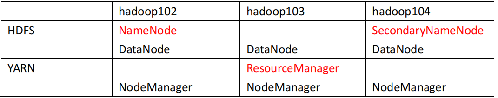
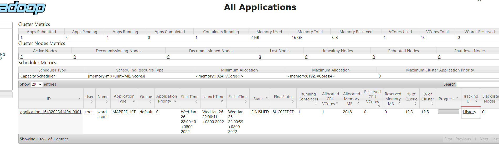

1) 将模板虚拟机上的Hadoop拷贝过来
        
        scp -r root@192.168.109.129:/software/hadoop-3.1.3
        
2) 集群部署规划

        ➢ NameNode 和 SecondaryNameNode 不要安装在同一台服务器
        ➢ ResourceManager 也很消耗内存，不要和 NameNode、SecondaryNameNode 配置在
        同一台机器上。
        
     
     
3) 配置文件说明

        Hadoop 配置文件分两类：默认配置文件和自定义配置文件，只有用户想修改某一默认配置值时，才需要修改自定义配置文件，更改相应属性值。
        
    1) 默认配置文件
    
            要获取的默认文件 文件存放在 Hadoop 的 jar 包中的位置
            [core-default.xml] hadoop-common-3.1.3.jar/core-default.xml
            [hdfs-default.xml] hadoop-hdfs-3.1.3.jar/hdfs-default.xml
            [yarn-default.xml] hadoop-yarn-common-3.1.3.jar/yarn-default.xml
            [mapred-default.xml] hadoop-mapreduce-client-core-3.1.3.jar/mapred-default.xml
            
    2)  自定义配置文件
       
            core-site.xml、hdfs-site.xml、yarn-site.xml、mapred-site.xml 四个配置文件存放在
            $HADOOP_HOME/etc/hadoop 这个路径上，用户可以根据项目需求重新进行修改配置
            
4) 配置集群
        
    1) 核心配置文件，配置 core-site.xml
        
            <?xml version="1.0" encoding="UTF-8"?>
            <?xml-stylesheet type="text/xsl" href="configuration.xsl"?>
            <configuration>
                 <!-- 指定 NameNode 的地址，内部使用 -->
                 <property>
                    <name>fs.defaultFS</name>
                    <value>hdfs://192.168.109.129:8020</value>
                 </property>
                 <!-- 指定 hadoop 数据的存储目录 -->
                 <property>
                     <name>hadoop.tmp.dir</name>
                     <value>/software/hadoop-3.1.3/data</value>
                 </property>
                 <!-- 配置 HDFS 网页登录使用的静态用户为 root,需要和启动hadoop的用户一样，否则后面操作会提示没有权限 -->
                 <property>
                     <name>hadoop.http.staticuser.user</name>
                     <value>root</value>
                 </property>
            </configuration>
            
    2) HDFS 配置文件，配置 hdfs-site.xml
            
            <?xml version="1.0" encoding="UTF-8"?>
            <?xml-stylesheet type="text/xsl" href="configuration.xsl"?>
            <configuration>
                <!-- nn web 端访问地址-->
                <property>
                     <name>dfs.namenode.http-address</name>
                     <value>192.168.109.129:9870</value>
                 </property>
                <!-- 2nn web 端访问地址-->
                <!-- 
                 <property>
                     <name>dfs.namenode.secondary.http-address</name>
                     <value>hadoop104:9868</value>
                 </property>
                 -->
            </configuration>
            
    3) YARN 配置文件，配置 yarn-site.xml
    
            <?xml version="1.0" encoding="UTF-8"?>
            <?xml-stylesheet type="text/xsl" href="configuration.xsl"?>
            <configuration>
                 <!-- 指定 MR 走 shuffle -->
                 <property>
                     <name>yarn.nodemanager.aux-services</name>
                     <value>mapreduce_shuffle</value>
                 </property>
                 <!-- 指定 ResourceManager 的地址-->
                 <property>
                     <name>yarn.resourcemanager.hostname</name>
                     <value>192.168.109.130</value>
                 </property>
                 <!-- 环境变量的继承 -->
                 <property>
                     <name>yarn.nodemanager.env-whitelist</name>
                     
                    <value>JAVA_HOME,HADOOP_COMMON_HOME,HADOOP_HDFS_HOME,HADOOP_CO
                    NF_DIR,CLASSPATH_PREPEND_DISTCACHE,HADOOP_YARN_HOME,HADOOP_MAP
                    RED_HOME,HADOOP_HOME</value>
                 </property>
            </configuration>
            
    4) MapReduce 配置文件，配置 mapred-site.xml
            
            <?xml version="1.0" encoding="UTF-8"?>
            <?xml-stylesheet type="text/xsl" href="configuration.xsl"?>
            <configuration>
                 <!-- 指定 MapReduce 程序运行在 Yarn 上 -->
                 <property>
                     <name>mapreduce.framework.name</name>
                     <value>yarn</value>
                 </property>
                 <property>
                   <name>yarn.app.mapreduce.am.env</name>
                   <value>HADOOP_MAPRED_HOME=$HADOOP_HOME</value>
                 </property>
                 <property>
                   <name>mapreduce.map.env</name>
                   <value>HADOOP_MAPRED_HOME=$HADOOP_HOME</value>
                 </property>
                 <property>
                   <name>mapreduce.reduce.env</name>
                   <value>HADOOP_MAPRED_HOME=$HADOOP_HOME</value>
                 </property>

            </configuration>
            
    5) 集群分发配置
            
            xsync /software/hadoop-3.1.3/etc/hadoop/
   
    6) 配置 workers
            
            往下面文件中配置节点，每行不许有空格，hostname,ip都可以
            vim /software/hadoop-3.1.3/etc/hadoop/workers
            
            192.168.109.129
            192.168.109.130
         
    7) 启动集群
            
        1)  如果集群是第一次启动，需要在 192.168.109.129 节点格式化 NameNode（注意：格式
            化 NameNode，会产生新的集群 id，导致 NameNode 和 DataNode 的集群 id 不一致，集群找
            不到已往数据。如果集群在运行过程中报错，需要重新格式化 NameNode 的话，一定要先停 止 namenode 和 datanode 进程，并且要删除所有机器的 data 和 logs 目录，然后再进行格式
            化。）
        2) namenode 格式化
                
                hdfs namenode -format
                
        3) 启动 HDFS
        
                在192.168.109.129服务器上执行如下脚本
                
                sbin/start-dfs.sh
                已root账号启动时，可能会遇到下面的错误
                ERROR: Attempting to operate on hdfs namenode as root
                ERROR: but there is no HDFS_NAMENODE_USER defined. Aborting operation.
                
                需要在启动脚本上配置一下
                1.修改start-dfs.sh和stop-dfs.sh，在头部添加以下内容
                    
                    HDFS_ZKFC_USER=root
                    HDFS_JOURNALNODE_USER=root
                    HDFS_NAMENODE_USER=root
                    HDFS_SECONDARYNAMENODE_USER=root
                    HDFS_DATANODE_USER=root
                    HDFS_DATANODE_SECURE_USER=root
                
                2.修改start-yarn.sh和stop-yarn.sh
                    
                    HDFS_DATANODE_SECURE_USER=root
                    YARN_NODEMANAGER_USER=root
                    YARN_RESOURCEMANAGER_USER=root
                    
                3. 启动后如果没有出现data_node 说明data_node初始化失败，需要把将name/current下的VERSION中的clusterID复制到data/current下的VERSION中，覆盖掉原来的clusterID，重启即可
                   其他服务器也要一起改掉
        
        4) 启动YARN
        
                在192.168.109.129服务器上执行如下脚本
                
                sbin/start-yarn.sh
                
    8) 集群基本测试
        
        1) 上传文件到集群(192.168.109.129机器上测试)
                
                先创建文件夹：hadoop fs -mkdir /input
                然后上传：hadoop fs -put wcinput/word.txt /wcinput
                
        2) 查看 HDFS 文件存储路径
                
                /software/hadoop-3.1.3/data/dfs/data/current/BP-1939800840-192.168.109.129-1643032340030/current/finalized/subdir0/subdir0
                
                查看前面上传的文件
                
                cat /software/hadoop-3.1.3/data/dfs/data/current/BP-1939800840-192.168.109.129-1643032340030/current/finalized/subdir0/subdir0/blk_1073741825
                
        3) 集群下执行wordcount程序
            
                hadoop jar share/hadoop/mapreduce/hadoop-mapreduce-examples-3.1.3.jar wordcount /wcinput /wcoutput
                
    9) 配置历史服务器  
            
            为了查看程序的历史运行情况，需要配置一下历史服务器。具体配置步骤如下
            
        1) 配置 mapred-site.xml
            
                <!-- 历史服务器端地址 -->
                <property>
                 <name>mapreduce.jobhistory.address</name>
                 <value>k8s-node2:10020</value>
                </property>
                <!-- 历史服务器 web 端地址 -->
                <property>
                 <name>mapreduce.jobhistory.webapp.address</name>
                 <value>k8s-node2:19888</value>
                </property>
                
        2) 分发配置
                
                xsync $HADOOP_HOME/etc/hadoop/mapred-site.xml
                
        3) 在 k8s-node2 启动历史服务器
        
                mapred --daemon start historyserver
                
        4) 执行任务后在yarn上就可以看到任务的历史
            
          
          
    10) 配置日志的聚集 (在那个服务器启动的historyserver，下面配置就指定那个服务就行)
        
            日志聚集概念：应用运行完成以后，将程序运行日志信息上传到 HDFS 系统上。
            日志聚集功能好处：可以方便的查看到程序运行详情，方便开发调试。
            注意：开启日志聚集功能，需要重新启动 NodeManager 、ResourceManager 和
            HistoryServer。
            
        1) 配置 yarn-site.xml
        
                在该文件里面增加如下配置
                
                <!-- 开启日志聚集功能 -->
                <property>
                 <name>yarn.log-aggregation-enable</name>
                 <value>true</value>
                </property>
                <!-- 设置日志聚集服务器地址 -->
                <property> 
                 <name>yarn.log.server.url</name> 
                 <value>http://k8s-node2:19888/jobhistory/logs</value>
                </property>
                <!-- 设置日志保留时间为 7 天 -->
                <property>
                 <name>yarn.log-aggregation.retain-seconds</name>
                 <value>604800</value>
                </property>
        
        2) 分发配置
        
                xsync $HADOOP_HOME/etc/hadoop/yarnsite.xml
            
        3) 关闭 NodeManager 、ResourceManager 和 HistoryServer
        
                sbin/stop-yarn.sh                   
                mapred --daemon stop historyserver
                
        4) 启动 NodeManager 、ResourceManage 和 HistoryServer
        
                sbin/start-yarn.sh
                mapred --daemon start historyserver
                
        5) 删除 HDFS 上已经存在的输出文件
        
                hadoop fs -rm -r /wcoutput
                
        6) 执行 WordCount 程序
            
                 hadoop jar share/hadoop/mapreduce/hadoop-mapreduce-examples-3.1.3.jar wordcount /wcinput /wcoutput
             

            
                
            
                