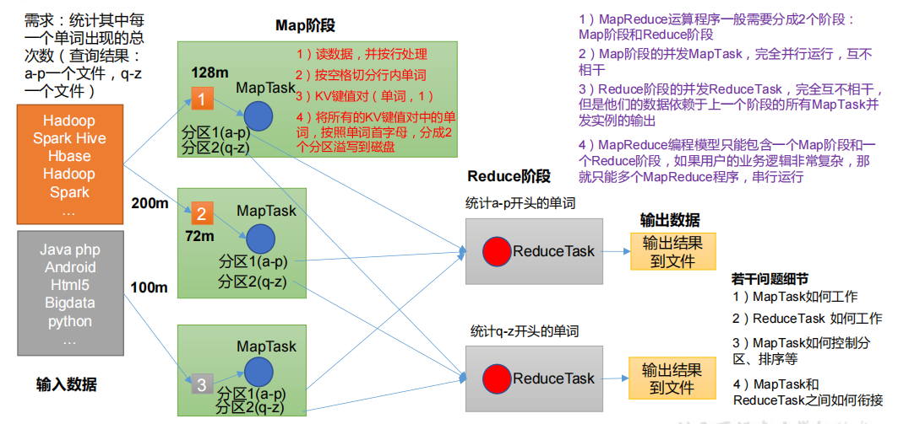
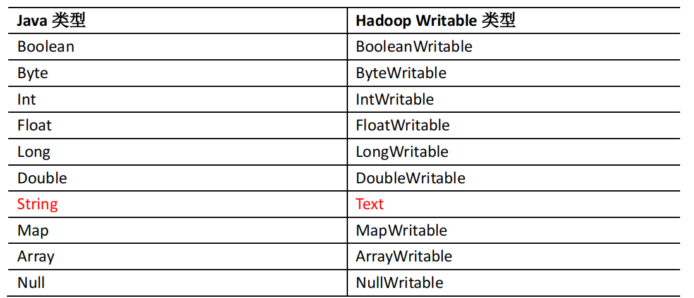
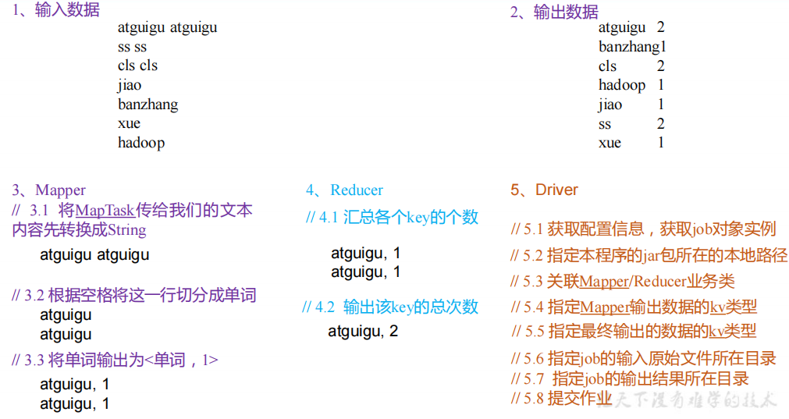

1) 定义
        
        MapReduce 是一个分布式运算程序的编程框架，是用户开发“基于 Hadoop 的数据分析应用”的核心框架。
        MapReduce 核心功能是将用户编写的业务逻辑代码和自带默认组件整合成一个完整的分布式运算程序，并发运行在一个 Hadoop 集群上。
        
2) 优势/劣势
    
    1) 优点
        
        1）MapReduce 易于编程
        
        它简单的实现一些接口，就可以完成一个分布式程序，这个分布式程序可以分布到大量
        廉价的 PC 机器上运行。也就是说你写一个分布式程序，跟写一个简单的串行程序是一模一
        样的。就是因为这个特点使得 MapReduce 编程变得非常流行。
        
        2）良好的扩展性
        
        当你的计算资源不能得到满足的时候，你可以通过简单的增加机器来扩展它的计算能力。
        
        3）高容错性
        
        MapReduce 设计的初衷就是使程序能够部署在廉价的 PC 机器上，这就要求它具有很高
        的容错性。比如其中一台机器挂了，它可以把上面的计算任务转移到另外一个节点上运行，
        不至于这个任务运行失败，而且这个过程不需要人工参与，而完全是由 Hadoop 内部完成的。
        
        4）适合 PB 级以上海量数据的离线处理
        
        可以实现上千台服务器集群并发工作，提供数据处理能力。
        
    2) 缺点
        
        1）不擅长实时计算
        
            MapReduce 无法像 MySQL 一样，在毫秒或者秒级内返回结果。
            
        2）不擅长流式计算
            
            流式计算的输入数据是动态的，而 MapReduce 的输入数据集是静态的，不能动态变化。
            这是因为 MapReduce 自身的设计特点决定了数据源必须是静态的。
            
        3）不擅长 DAG（有向无环图）计算
        
            多个应用程序存在依赖关系，后一个应用程序的输入为前一个的输出。在这种情况下，
            MapReduce 并不是不能做，而是使用后，每个 MapReduce 作业的输出结果都会写入到磁盘，
            会造成大量的磁盘 IO，导致性能非常的低下。

3) MapReduce 核心思想
    
    
    
        （1）分布式的运算程序往往需要分成至少 2 个阶段。
        （2）第一个阶段的 MapTask 并发实例，完全并行运行，互不相干。
        （3）第二个阶段的 ReduceTask 并发实例互不相干，但是他们的数据依赖于上一个阶段的所有 MapTask 并发实例的输出。
        （4）MapReduce 编程模型只能包含一个 Map 阶段和一个 Reduce 阶段，如果用户的业务逻辑非常复杂，那就只能多个 MapReduce 程序，串行运行。
         总结：分析 WordCount 数据流走向深入理解 MapReduce 核心思想。
         
4) MapReduce 进程
    
         一个完整的 MapReduce 程序在分布式运行时有三类实例进程：
         
         （1）MrAppMaster：负责整个程序的过程调度及状态协调。
         （2）MapTask：负责 Map 阶段的整个数据处理流程。
         （3）ReduceTask：负责 Reduce 阶段的整个数据处理流程。
         
5) 常用数据序列化类型
    
    
    
    
6) MapReduce 编程规范
    
    用户编写的程序分成三个部分：Mapper、Reducer 和 Driver。
    
    1．Mapper阶段
    （1）用户自定义的Mapper要继承自己的父类
    （2）Mapper的输入数据是KV对的形式（KV的类型可自定义） 
    （3）Mapper中的业务逻辑写在map()方法中
    （4）Mapper的输出数据是KV对的形式（KV的类型可自定义） 
    （5）map()方法（MapTask进程）对每一个<K,V>调用一次
    
    2．Reducer阶段
    （1）用户自定义的Reducer要继承自己的父类
    （2）Reducer的输入数据类型对应Mapper的输出数据类型，也是KV
    （3）Reducer的业务逻辑写在reduce()方法中
    （4）ReduceTask进程对每一组相同k的<k,v>组调用一次reduce()方法
    
    3．Driver阶段
    相当于YARN集群的客户端，用于提交我们整个程序到YARN集群，提交的是
    封装了MapReduce程序相关运行参数的job对象
         
4) WordCount实例

    
    1）需求
    
         在给定的文本文件中统计输出每一个单词出现的总次数
        
        （1）输入数据
               atguigu atguigu
               ss ss
               cls cls
               jiao
               banzhang
               xue
               hadoop
               
        （2）期望输出数据
            atguigu 2
            banzhang 1
            cls 2
            hadoop 1
            jiao 1
            ss 2
            xue 1
            
    2）需求分析
    
        按照 MapReduce 编程规范，分别编写 Mapper，Reducer，Driver。
        
