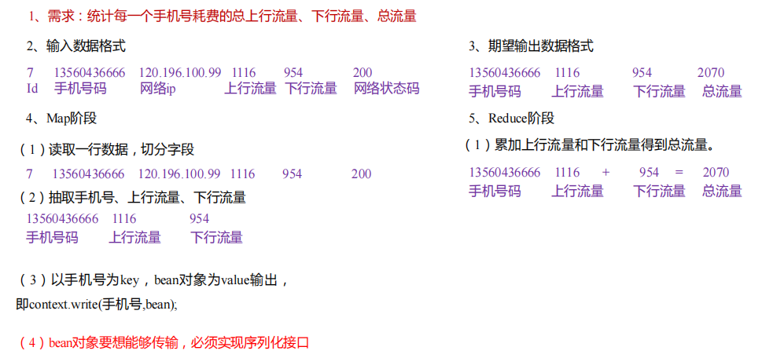

1) 什么是序列化

        序列化就是把内存中的对象，转换成字节序列（或其他数据传输协议）以便于存储到磁盘（持久化）和网络传输。
        
        反序列化就是将收到字节序列（或其他数据传输协议）或者是磁盘的持久化数据，转换成内存中的对象。
        
2) 为什么要序列化

        一般来说，“活的”对象只生存在内存里，关机断电就没有了。而且“活的”对象只能
        由本地的进程使用，不能被发送到网络上的另外一台计算机。 然而序列化可以存储“活的”
        对象，可以将“活的”对象发送到远程计算机。
        
3) 为什么不用 Java 的序列化

        Java 的序列化是一个重量级序列化框架（Serializable），一个对象被序列化后，会附带
        很多额外的信息（各种校验信息，Header，继承体系等），不便于在网络中高效传输。所以，
        Hadoop 自己开发了一套序列化机制（Writable）。
        
4) Hadoop 序列化特点：

        （1）紧凑 ：高效使用存储空间。
        （2）快速：读写数据的额外开销小。
        （3）互操作：支持多语言的交互
        
5) 自定义 bean 对象实现序列化接口（Writable）

        在企业开发中往往常用的基本序列化类型不能满足所有需求，比如在 Hadoop 框架内部传递一个 bean 对象，那么该对象就需要实现序列化接口。
        
        具体实现 bean 对象序列化步骤如下 7 步。 
        （1）必须实现 Writable 接口
        （2）反序列化时，需要反射调用空参构造函数，所以必须有空参构造
        
            public FlowBean() {
            super();
            }
            
        （3）重写序列化方法
        
            @Override
            public void write(DataOutput out) throws IOException {
                out.writeLong(upFlow);
                out.writeLong(downFlow);
                out.writeLong(sumFlow);
            }
            
        （4）重写反序列化方法
            
            @Override
            public void readFields(DataInput in) throws IOException {
                upFlow = in.readLong();
                downFlow = in.readLong();
                sumFlow = in.readLong();
            }
            
        （5）注意反序列化的顺序和序列化的顺序完全一致
        （6）要想把结果显示在文件中，需要重写 toString()，可用"\t"分开，方便后续用。
        （7）如果需要将自定义的 bean 放在 key 中传输，则还需要实现 Comparable 接口，因为MapReduce 框中的 Shuffle 过程要求对 key 必须能排序。详见后面排序案例。
        
            @Override
            public int compareTo(FlowBean o) {
                // 倒序排列，从大到小
                return this.sumFlow > o.getSumFlow() ? -1 : 1;
            }
            
6) 案例
    
        统计每一个手机号耗费的总上行流量、总下行流量、总流量
        
        （2）输入数据格式：
        7 13560436666  120.196.100.99    1116       954      200
        id 手机号码    网络 ip           上行流量   下行流量   网络状态码
        
        （3）期望输出数据格式
        13560436666 1116      954       2070
        手机号码    上行流量  下行流量     总流量
        

    
    看代码 hadoop项目，com.daiyanping.hadoop.writable.FlowDriver
        