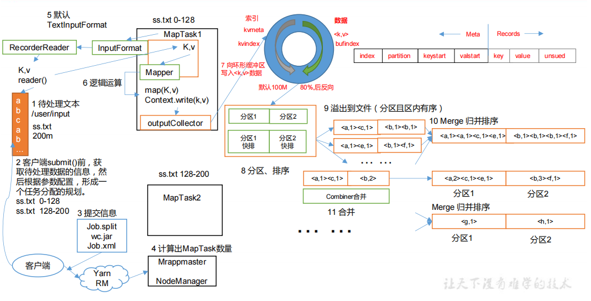
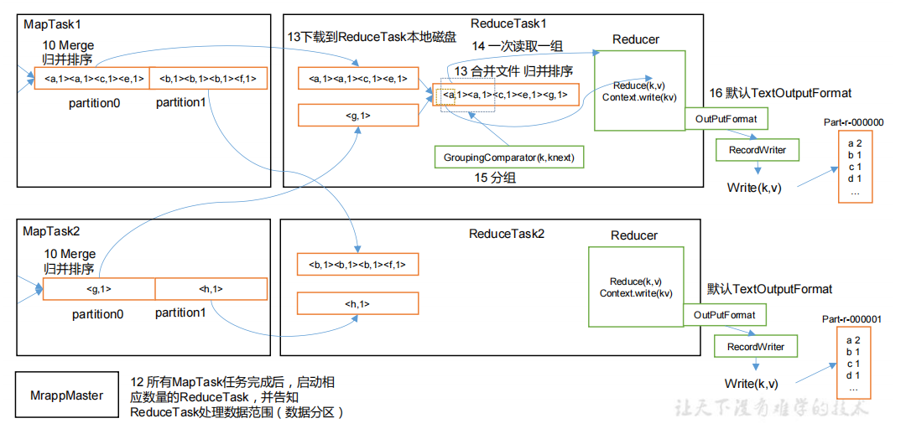
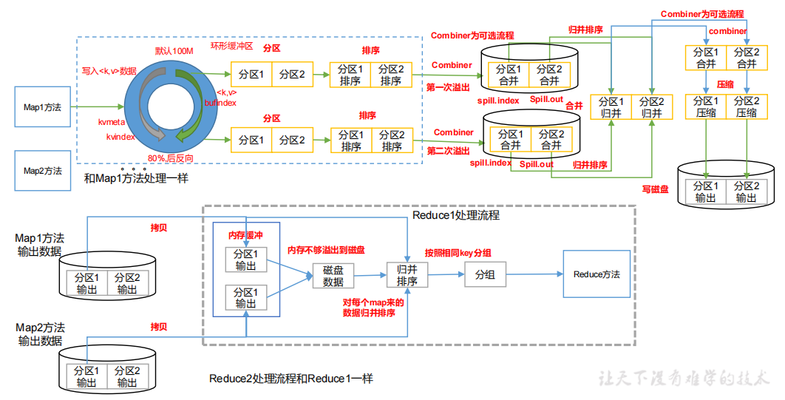

1) 输入的数据InputFormat
    
    1：切片与 MapTask 并行度决定机制
        
        1）问题引出
        MapTask 的并行度决定 Map 阶段的任务处理并发度，进而影响到整个 Job 的处理速度。
        思考：1G 的数据，启动 8 个 MapTask，可以提高集群的并发处理能力。那么 1K 的数
        据，也启动 8 个 MapTask，会提高集群性能吗？MapTask 并行任务是否越多越好呢？哪些因
        素影响了 MapTask 并行度？
        
        2）MapTask 并行度决定机制
        数据块：Block 是 HDFS 物理上把数据分成一块一块。数据块是 HDFS 存储数据单位。
        数据切片：数据切片只是在逻辑上对输入进行分片，并不会在磁盘上将其切分成片进行
        存储。数据切片是 MapReduce 程序计算输入数据的单位，一个切片会对应启动一个 MapTask。
        
    
    
   2) Job 提交流程源码详解
    
        waitForCompletion()
        submit();
        // 1 建立连接
        connect();
        // 1）创建提交 Job 的代理
        new Cluster(getConfiguration());
        // （1）判断是本地运行环境还是 yarn 集群运行环境
        initialize(jobTrackAddr, conf); 
        // 2 提交 job
        submitter.submitJobInternal(Job.this, cluster)
        // 1）创建给集群提交数据的 Stag 路径
        Path jobStagingArea = JobSubmissionFiles.getStagingDir(cluster, conf);
        // 2）获取 jobid ，并创建 Job 路径
        JobID jobId = submitClient.getNewJobID();
        // 3）拷贝 jar 包到集群
        copyAndConfigureFiles(job, submitJobDir);
        rUploader.uploadFiles(job, jobSubmitDir);
        // 4）计算切片，生成切片规划文件
        writeSplits(job, submitJobDir);
        maps = writeNewSplits(job, jobSubmitDir);
        input.getSplits(job);
        // 5）向 Stag 路径写 XML 配置文件
        writeConf(conf, submitJobFile);
        conf.writeXml(out);
        // 6）提交 Job,返回提交状态
        status = submitClient.submitJob(jobId, submitJobDir.toString(),job.getCredentials());
        
   3) FileInputFormat 切片源码解析（input.getSplits(job)）
   
       （1）程序先找到你数据存储的目录。
       （2）开始遍历处理（规划切片）目录下的每一个文件
       （3）遍历第一个文件ss.txt
           a）获取文件大小fs.sizeOf(ss.txt)
           b）计算切片大小
             computeSplitSize(Math.max(minSize,Math.min(maxSize,blocksize)))=blocksize=128M
           c）默认情况下，切片大小=blocksize
           d）开始切，形成第1个切片：ss.txt—0:128M 第2个切片ss.txt—128:256M 第3个切片ss.txt—256M:300M
           （每次切片时，都要判断切完剩下的部分是否大于块的1.1倍，不大于1.1倍就划分一块切片） e）将切片信息写到一个切片规划文件中
           f）整个切片的核心过程在getSplit()方法中完成
           g）InputSplit只记录了切片的元数据信息，比如起始位置、长度以及所在的节点列表等。
      （4）提交切片规划文件到YARN上，YARN上的MrAppMaster就可以根据切片规划文件计算开启MapTask个数。
      
      （5）切片机制
            
            （1）简单地按照文件的内容长度进行切片
            （2）切片大小，默认等于Block大小
            （3）切片时不考虑数据集整体，而是逐个针对每一个文件单独切片
      
   
   4) TextInputFormat
    
        1）FileInputFormat 实现类
        
            思考：在运行 MapReduce 程序时，输入的文件格式包括：基于行的日志文件、二进制
            格式文件、数据库表等。那么，针对不同的数据类型，MapReduce 是如何读取这些数据的呢？
            FileInputFormat 常见的接口实现类包括：TextInputFormat、KeyValueTextInputFormat、
            NLineInputFormat、CombineTextInputFormat 和自定义 InputFormat 等。
            
        2）TextInputFormat
        
            TextInputFormat 是默认的 FileInputFormat 实现类。按行读取每条记录。键是存储该行在
            整个文件中的起始字节偏移量， LongWritable 类型。值是这行的内容，不包括任何行终止
            符（换行符和回车符），Text 类型。
            
            以下是一个示例，比如，一个分片包含了如下 4 条文本记录。
                Rich learning form
                Intelligent learning engine
                Learning more convenient
                From the real demand for more close to the enterprise
            每条记录表示为以下键/值对：
                (0,Rich learning form)
                (20,Intelligent learning engine)
                (49,Learning more convenient)
                (74,From the real demand for more close to the enterprise)
                
   5) CombineTextInputFormat 切片机制
    
        框架默认的 TextInputFormat 切片机制是对任务按文件规划切片，不管文件多小，都会
        是一个单独的切片，都会交给一个 MapTask，这样如果有大量小文件，就会产生大量的
        MapTask，处理效率极其低下。
        
        1）应用场景：
        
            CombineTextInputFormat 用于小文件过多的场景，它可以将多个小文件从逻辑上规划到
            一个切片中，这样，多个小文件就可以交给一个 MapTask 处理。
            
        2）虚拟存储切片最大值设置
        
            CombineTextInputFormat.setMaxInputSplitSize(job, 4194304);// 4m
            注意：虚拟存储切片最大值设置最好根据实际的小文件大小情况来设置具体的值。
        
        3）切片机制
        
            生成切片过程包括：虚拟存储过程和切片过程二部分。
            
        
        
        （1）虚拟存储过程：
        
            将输入目录下所有文件大小，依次和设置的 setMaxInputSplitSize 值比较，如果不
            大于设置的最大值，逻辑上划分一个块。如果输入文件大于设置的最大值且大于两倍，
            那么以最大值切割一块；当剩余数据大小超过设置的最大值且不大于最大值 2 倍，此时
            将文件均分成 2 个虚拟存储块（防止出现太小切片）。
            例如 setMaxInputSplitSize 值为 4M，输入文件大小为 8.02M，则先逻辑上分成一个
            4M。剩余的大小为 4.02M，如果按照 4M 逻辑划分，就会出现 0.02M 的小的虚拟存储
            文件，所以将剩余的 4.02M 文件切分成（2.01M 和 2.01M）两个文件。 
            
        （2）切片过程：
        
            （a）判断虚拟存储的文件大小是否大于 setMaxInputSplitSize 值，大于等于则单独
            形成一个切片。
            （b）如果不大于则跟下一个虚拟存储文件进行合并，直到大于等于为止，共同形成一个切片（可能会有很多个虚拟存储文件在一个切片中）。
            （c）测试举例：有 4 个小文件大小分别为 1.7M、5.1M、3.4M 以及 6.8M 这四个小
            文件，则虚拟存储之后形成 6 个文件块，大小分别为：
            1.7M，（2.55M、2.55M），3.4M 以及（3.4M、3.4M）
            最终会形成 3 个切片，大小分别为： （1.7+2.55）M，（2.55+3.4）M，（3.4+3.4）M
    
   6) CombineTextInputFormat 案例实操 
   
        1）需求
            
            将输入的大量小文件合并成一个切片统一处理。 （1）输入数据
            准备 4 个小文件
            
        2） 期望
        
            期望一个切片处理 4 个文件
            
        3）实现过程
        
            （1）不做任何处理，运行 1.8 节的 WordCount 案例程序，观察切片个数为 4。 number of splits:4
            （2）在 WordcountDriver 中增加如下代码，运行程序，并观察运行的切片个数为 3。 
            （a）驱动类中添加代码如下：
            
                // 如果不设置 InputFormat，它默认用的是 TextInputFormat.class
                job.setInputFormatClass(CombineTextInputFormat.class);
                //虚拟存储切片最大值设置 4m
                CombineTextInputFormat.setMaxInputSplitSize(job, 4194304);
                
            （b）运行如果为 3 个切片。
            
                number of splits:3 
            （3）在 WordcountDriver 中增加如下代码，运行程序，并观察运行的切片个数为 1。 
            （a）驱动中添加代码如下：
                // 如果不设置 InputFormat，它默认用的是 TextInputFormat.class
                job.setInputFormatClass(CombineTextInputFormat.class);
                //虚拟存储切片最大值设置 20m
                CombineTextInputFormat.setMaxInputSplitSize(job, 20971520);
                
            （b）运行如果为 1 个切片
            
                 number of splits:1
    
2) MapReduce 工作流程
    
     
     
     
     上面的流程是整个 MapReduce 最全工作流程，但是 Shuffle 过程只是从第 7 步开始到第
     16 步结束，具体 Shuffle 过程详解，如下：
     （1）MapTask 收集我们的 map()方法输出的 kv 对，放到内存缓冲区中
     （2）从内存缓冲区不断溢出本地磁盘文件，可能会溢出多个文件
     （3）多个溢出文件会被合并成大的溢出文件
     （4）在溢出过程及合并的过程中，都要调用 Partitioner 进行分区和针对 key 进行排序
     （5）ReduceTask 根据自己的分区号，去各个 MapTask 机器上取相应的结果分区数据
     （6）ReduceTask 会抓取到同一个分区的来自不同 MapTask 的结果文件，ReduceTask 会将这些文件再进行合并（归并排序）
     （7）合并成大文件后，Shuffle 的过程也就结束了，后面进入 ReduceTask 的逻辑运算过程（从文件中取出一个一个的键值对 Group，调用用户自定义的 reduce()方法）
     
     注意： 
     （1）Shuffle 中的缓冲区大小会影响到 MapReduce 程序的执行效率，原则上说，缓冲区越大，磁盘 io 的次数越少，执行速度就越快。
     （2）缓冲区的大小可以通过参数调整，参数：mapreduce.task.io.sort.mb 默认 100M。

3) Shuffle
    
    

4) 分区
    
    1、问题引出
    
        要求将统计结果按照条件输出到不同文件中（分区）。比如：将统计结果按照手机
        归属地不同省份输出到不同文件中（分区）
     
    2、默认Partitioner分区
    
        public class HashPartitioner<K, V> extends Partitioner<K, V> {
        
            public int getPartition(K key, V value, int numReduceTasks) {
                return (key.hashCode() & Integer.MAX_VALUE) % numReduceTasks; 
                } 
        }
        
        默 认分区是根据key的hashCode对ReduceTasks个数取模得到的。用户没法控制哪个
        key存储到哪个分区。
        
        
   3、自定义Partitioner步骤
   
       （1）自定义类继承Partitioner，重写getPartition()方法
        
            public class CustomPartitioner extends Partitioner<Text, FlowBean> {
                @Override
                public int getPartition(Text key, FlowBean value, int numPartitions) {
                    // 控制分区代码逻辑
                    … …
                    return partition; 
                } 
            } 
            
       （2）在Job驱动中，设置自定义Partitioner
        
            job.setPartitionerClass(CustomPartitioner.class);
        
       （3）自定义Partition后，要根据自定义Partitioner的逻辑设置相应数量的ReduceTask
        
            job.setNumReduceTasks(5);
            
   4、分区总结
   
   （1）如果ReduceTask的数量 > getPartition的结果数，则会多产生几个空的输出文件part-r-000xx； 
   （2）如果 1 < ReduceTask的数量 < getPartition的结果数，则有一部分分区数据无处安放，会Exception；
   （3）如 果ReduceTask的数量=1，则不管MapTask端输出多少个分区文件，最终结果都交给这一个ReduceTask，最终也就只会产生一个结果文件 part-r-00000； 
    
   5、案例分析
   
   例如：假设自定义分区数为5，则
   （1）job.setNumReduceTasks(1); （2）job.setNumReduceTasks(2); （3）job.setNumReduceTasks(6);
   会正常运行，只不过会产生一个输出文件会报错大于5，程序会正常运行，会产生空文件
        
        
5) 排序
    
    排序是MapReduce框架中最重要的操作之一。
    MapTask和ReduceTask均会对数据按 照key进行排序。该操作属于Hadoop的默认行为。任何应用程序中的数据均会被排序，而不管逻辑上是否需要。
    默认排序是按照字典顺序排序，且实现该排序的方法是快速排序。
    
    对于MapTask，它会将处理的结果暂时放到环形缓冲区中，当环形缓冲区使
    用率达到一定阈值后，再对缓冲区中的数据进行一次快速排序，并将这些有序数 据溢写到磁盘上，而当数据处理完毕后，它会对磁盘上所有文件进行归并排序。
    对于ReduceTask，它从每个MapTask上远程拷贝相应的数据文件，如果文件大
    小超过一定阈值，则溢写磁盘上，否则存储在内存中。如果磁盘上文件数目达到
    一定阈值，则进行一次归并排序以生成一个更大文件；如果内存中文件大小或者
    数目超过一定阈值，则进行一次合并后将数据溢写到磁盘上。当所有数据拷贝完
    毕后，ReduceTask统一对内存和磁盘上的所有数据进行一次归并排序。
    
    （1）部分排序
    
        MapReduce根据输入记录的键对数据集排序。保证输出的每个文件内部有序。 
        
    （2）全排序
    
        最终输出结果只有一个文件，且文件内部有序。实现方式是只设置一个ReduceTask。但该方法在
        处理大型文件时效率极低，因为一台机器处理所有文件，完全丧失了MapReduce所提供的并行架构。
        
    （3）辅助排序：（GroupingComparator分组） 
        
        在Reduce端对key进行分组。应用于：在接收的key为bean对象时，想让一个或几个字段相同（全部字段比较不相同）的key进入到同一个reduce方法时，可以采用分组排序。
        
    （4）二次排序
    
        在自定义排序过程中，如果compareTo中的判断条件为两个即为二次排序。
    
3) 输出数据OutputFormat

4) Join

5) ETL

6) 总结