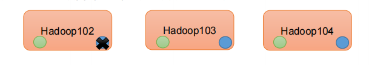
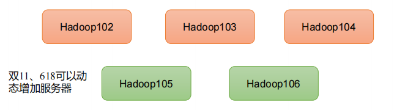
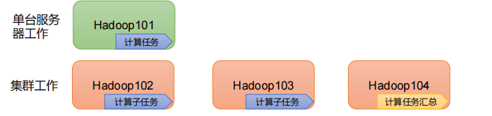

1) 高可靠性：Hadoop底层维护多个数据副本，所以即使Hadoop某个计算元素或存储出现故障，也不会导致数据的丢失。
    
    
    
2) 高扩展性：在集群间分配任务数据，可方便的扩展数以千计的节点。
    
    
    
3) 高效性：在MapReduce的思想下，Hadoop是并行工作的，以加快任务处理速度。
    
    
    
4) 高容错性：能够自动将失败的任务重新分配。
    
    