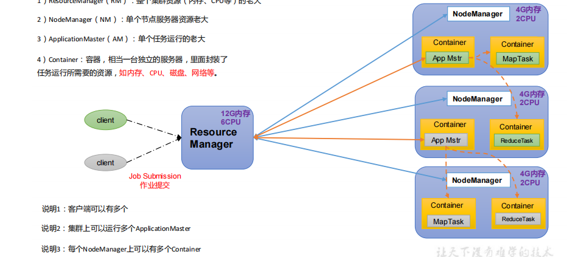
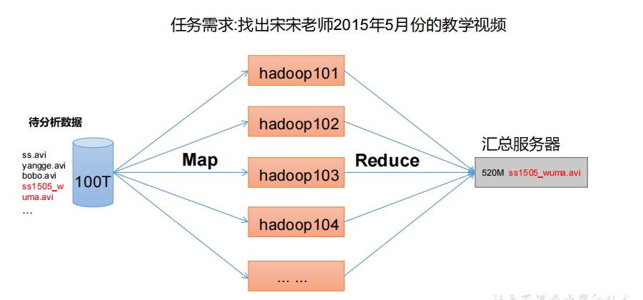
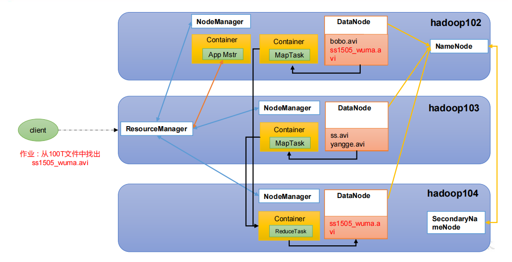

1) Hadoop1.x组成
    
        Common(辅助工具)
        HDFS(数据存储)
        MapReduce(计算+资源调度)
        
2) Hadoop2.x组成
        
        Common(辅助工具)
        HDFS(数据存储)
        MapReduce(计算)
        Yarn(资源调度)
     
3) Hadoop3.x在组成上没有啥区别

4) HDFS架构概述

        Hadoop Distributed File System，简称 HDFS，是一个分布式文件系统。
    
    1) NameNode（nn）：存储文件的元数据，如文件名，文件目录结构，文件属性（生成时间、副本数、
    文件权限），以及每个文件的块列表和块所在的DataNode等。
    
    2) DataNode(dn)：在本地文件系统存储文件块数据，以及块数据的校验和。
    
    3) Secondary NameNode(2nn)：每隔一段时间对NameNode元数据备份。
    
5)  YARN 架构概述
        
        Yet Another Resource Negotiator 简称 YARN ，另一种资源协调者，是 Hadoop 的资源管理器。
        
    1) ResourceManager（RM）：整个集群资源（内存、CPU等）的老大
    2) NodeManager（N M）：单个节点服务器资源老大
    3) ApplicationMaster（AM）：单个任务运行的老大
    4) Container：容器，相当一台独立的服务器，里面封装了
    任务运行所需要的资源，如内存、CPU、磁盘、网络等。
    
    
    
6) MapReduce 架构概述
        
        MapReduce 将计算过程分为两个阶段：Map 和 Reduce
        
    1) Map 阶段并行处理输入数据
    2) Reduce 阶段对 Map 结果进行汇总
    
    
    
7) HDFS、YARN、MapReduce 三者关系
    
    