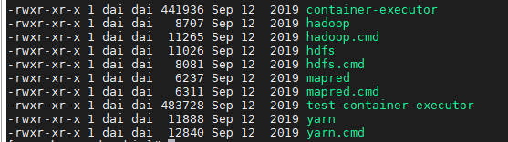

1) 选择Hadoop安装包
        
        安装包获取连接：https://archive.apache.org/dist/hadoop/common/
        
2) 我们选择hadoop-3.1.3这个版本

3) 下载
    
        wget https://archive.apache.org/dist/hadoop/common/hadoop-3.1.3/hadoop-3.1.3.tar.gz
        
4) 解压 
        
        tar -zxvf hadoop-3.1.3.tar.gz
        
5) 配置环境变量

        按照 profile 文件提示的样子去添加，在/etc/profile.d/目录中，添加脚本 export 环境变量
        vi /etc/profile.d/my_env.sh
        
        export HADOOP_HOME=/software/hadoop-3.1.3
        export PATH=$PATH:$HADOOP_HOME/bin
        export PATH=$PATH:$HADOOP_HOME/sbin
        
        配置生效命令
        source /etc/profile
        
6) bin 目录包含了操作hadoop,hdfs,mapred,yarn的命令
    
    
    
7) etc/hadoop目录包含了大量的配置信息

8) 重要目录
        
        （1）bin 目录：存放对 Hadoop 相关服务（hdfs，yarn，mapred）进行操作的脚本
        （2）etc 目录：Hadoop 的配置文件目录，存放 Hadoop 的配置文件
        （3）lib 目录：存放 Hadoop 的本地库（对数据进行压缩解压缩功能）
        （4）sbin 目录：存放启动或停止 Hadoop 相关服务的脚本
        （5）share 目录：存放 Hadoop 的依赖 jar 包、文档、和官方案例

    