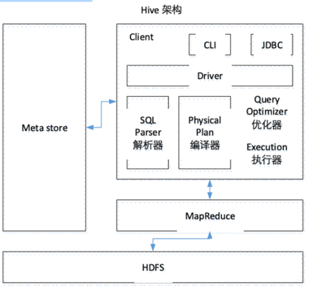
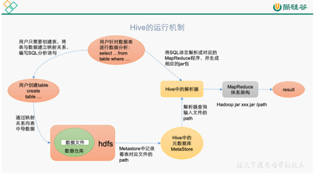

1 什么是Hive
    
    Hive：由Facebook开源用于解决海量结构化日志的数据统计工具。
    Hive是基于Hadoop的一个数据仓库工具，可以将结构化的数据文件映射为一张表，并提供类SQL查询功能。

2 Hive本质

     将HQL转化成MapReduce程序

    （1）Hive处理的数据存储在HDFS
    （2）Hive分析数据底层的实现是MapReduce
    （3）执行程序运行在Yarn上
    
3 Hive的优缺点
     
     优点：
     
    （1）操作接口采用类SQL语法，提供快速开发的能力（简单、容易上手）。
    （2）避免了去写MapReduce，减少开发人员的学习成本。
    （3）Hive的执行延迟比较高，因此Hive常用于数据分析，对实时性要求不高的场合。
    （4）Hive优势在于处理大数据，对于处理小数据没有优势，因为Hive的执行延迟比较高。
    （5）Hive支持用户自定义函数，用户可以根据自己的需求来实现自己的函数。
     
     缺点：
     
     1）Hive的HQL表达能力有限

        （1）迭代式算法无法表达
        （2）数据挖掘方面不擅长，由于MapReduce数据处理流程的限制，效率更高的算法却无法实现。

    2）Hive的效率比较低

        （1）Hive自动生成的MapReduce作业，通常情况下不够智能化
        （2）Hive调优比较困难，粒度较粗

4 Hive架构原理
    

    1）用户接口：Client
    CLI（command-line interface）、JDBC/ODBC(jdbc访问hive)、WEBUI（浏览器访问hive）
    2）元数据：Metastore
    元数据包括：表名、表所属的数据库（默认是default）、表的拥有者、列/分区字段、表的类型（是否是外部表）、表的数据所在目录等；
    默认存储在自带的derby数据库中，推荐使用MySQL存储Metastore
    3）Hadoop
    使用HDFS进行存储，使用MapReduce进行计算。
    4）驱动器：Driver
    （1）解析器（SQL Parser）：将SQL字符串转换成抽象语法树AST，这一步一般都用第三方工具库完成，比如antlr；对AST进行语法分析，比如表是否存在、字段是否存在、SQL语义是否有误。
    （2）编译器（Physical Plan）：将AST编译生成逻辑执行计划。
    （3）优化器（Query Optimizer）：对逻辑执行计划进行优化。
    （4）执行器（Execution）：把逻辑执行计划转换成可以运行的物理计划。对于Hive来说，就是MR/Spark。

    Hive通过给用户提供的一系列交互接口，接收到用户的指令(SQL)，使用自己的Driver，结合元数据(MetaStore)，将这些指令翻译成MapReduce，提交到Hadoop中执行，最后，将执行返回的结果输出到用户交互接口。

5 Hive和 数据库比较

    由于Hive采用了类似SQL的查询语言HQL(Hive Query Language)，因此很容易将Hive理解为数据库。其实从结构上来看，Hive和数据库除了拥有类似的查询语言，再无类似之处。本文将从多个方面来阐述Hive和数据库的差异。数据库可以用在Online的应用中，
    但是Hive是为数据仓库而设计的，清楚这一点，有助于从应用角度理解Hive的特性。