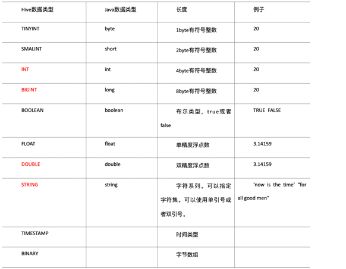
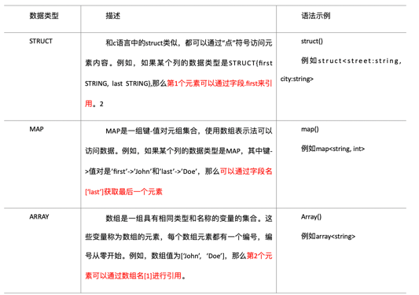

1: 基本数据类型
    

    对于Hive的String类型相当于数据库的varchar类型，该类型是一个可变的字符串，不过它不能声明其中最多能存储多少个字符，理论上它可以存储2GB的字符数。

2: 集合数据类型

    
    Hive有三种复杂数据类型ARRAY、MAP 和 STRUCT。ARRAY和MAP与Java中的Array和Map类似，而STRUCT与C语言中的Struct类似，它封装了一个命名字段集合，复杂数据类型允许任意层次的嵌套。

    create table test(
        name string,
        friends array<string>,
        children map<string, int>,
        address struct<street:string, city:string>
    )
    row format delimited fields terminated by ','
    collection items terminated by '_'
    map keys terminated by ':'
    lines terminated by '\n';

    字段解释：
    row format delimited fields terminated by ','  -- 列分隔符
    collection items terminated by '_'  	--MAP STRUCT 和 ARRAY 的分隔符(数据分割符号)
    map keys terminated by ':'			-- MAP中的key与value的分隔符
    lines terminated by '\n';				-- 行分隔符
        
    导入文本数据到测试表
    load data local inpath '/software/apache-hive-2.3.9-bin/datas/test.txt' into table test; 

    访问三种集合列里的数据，以下分别是ARRAY，MAP，STRUCT的访问方式
    select friends[1],children['xiao song'],address.city from test where name="songsong";

    
