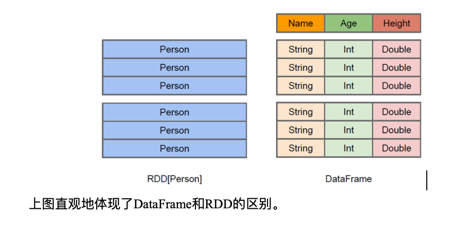
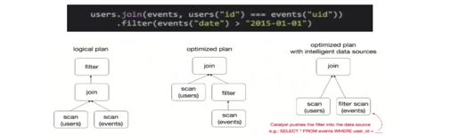

1: SparkSQL是什么
    
    Spark SQL是Spark用于结构化数据(structured data)处理的Spark模块。

2: Hive and SparkSQL
    
    SparkSQL的前身是Shark，给熟悉RDBMS但又不理解MapReduce的技术人员提供快速上手的工具。
    Hive是早期唯一运行在Hadoop上的SQL-on-Hadoop工具。但是MapReduce计算过程中大量的中间磁盘落地过程消耗了大量的I/O，降低的运行效率，为了提高SQL-on-Hadoop的效率，
    大量的SQL-on-Hadoop工具开始产生，其中表现较为突出的是：
    Drill
    Impala
    Shark
        
    其中Shark是伯克利实验室Spark生态环境的组件之一，是基于Hive所开发的工具，它修改了下图所示的右下角的内存管理、物理计划、执行三个模块，并使之能运行在Spark引擎上。

    Shark的出现，使得SQL-on-Hadoop的性能比Hive有了10-100倍的提高。
    
    但是，随着Spark的发展，对于野心勃勃的Spark团队来说，Shark对于Hive的太多依赖（如采用Hive的语法解析器、查询优化器等等），
    制约了Spark的One Stack Rule Them All的既定方针，制约了Spark各个组件的相互集成，所以提出了SparkSQL项目。SparkSQL抛弃原有Shark的代码，
    汲取了Shark的一些优点，如内存列存储（In-Memory Columnar Storage）、Hive兼容性等，重新开发了SparkSQL代码；由于摆脱了对Hive的依赖性，
    SparkSQL无论在数据兼容、性能优化、组件扩展方面都得到了极大的方便，真可谓“退一步，海阔天空”。

    1: 数据兼容方面 SparkSQL不但兼容Hive，还可以从RDD、parquet文件、JSON文件中获取数据，未来版本甚至支持获取RDBMS数据以及cassandra等NOSQL数据；
    2: 性能优化方面 除了采取In-Memory Columnar Storage、byte-code generation等优化技术外、将会引进Cost Model对查询进行动态评估、获取最佳物理计划等等；
    3: 组件扩展方面 无论是SQL的语法解析器、分析器还是优化器都可以重新定义，进行扩展。

    2014年6月1日Shark项目和SparkSQL项目的主持人Reynold Xin宣布：停止对Shark的开发，团队将所有资源放SparkSQL项目上，
    至此，Shark的发展画上了句话，但也因此发展出两个支线：SparkSQL和Hive on Spark。

    其中SparkSQL作为Spark生态的一员继续发展，而不再受限于Hive，只是兼容Hive；而Hive on Spark是一个Hive的发展计划，
    该计划将Spark作为Hive的底层引擎之一，也就是说，Hive将不再受限于一个引擎，可以采用Map-Reduce、Tez、Spark等引擎。
    对于开发人员来讲，SparkSQL可以简化RDD的开发，提高开发效率，且执行效率非常快，所以实际工作中，基本上采用的就是Spark SQL。Spark SQL为了简化RDD的开发，
    提高开发效率，提供了2个编程抽象，类似Spark Core中的RDD
    
    DataFrame
    DataSet

3: DataFrame是什么
    
    在Spark中，DataFrame是一种以RDD为基础的分布式数据集，类似于传统数据库中的二维表格。DataFrame与RDD的主要区别在于，前者带有schema元信息，
    即DataFrame所表示的二维表数据集的每一列都带有名称和类型。这使得Spark SQL得以洞察更多的结构信息，从而对藏于DataFrame背后的数据源以及作用于DataFrame之上的变换进行了针对性的优化，
    最终达到大幅提升运行时效率的目标。反观RDD，由于无从得知所存数据元素的具体内部结构，Spark Core只能在stage层面进行简单、通用的流水线优化。
    同时，与Hive类似，DataFrame也支持嵌套数据类型（struct、array和map）。从 API 易用性的角度上看，DataFrame API提供的是一套高层的关系操作，比函数式的RDD API 要更加友好，门槛更低。

    左侧的RDD[Person]虽然以Person为类型参数，但Spark框架本身不了解Person类的内部结构。而右侧的DataFrame却提供了详细的结构信息，
    使得 Spark SQL 可以清楚地知道该数据集中包含哪些列，每列的名称和类型各是什么。
    DataFrame是为数据提供了Schema的视图。可以把它当做数据库中的一张表来对待
    DataFrame也是懒执行的，但性能上比RDD要高，主要原因：优化的执行计划，即查询计划通过Spark catalyst optimiser进行优化。比如下面一个例子:

    为了说明查询优化，我们来看上图展示的人口数据分析的示例。图中构造了两个DataFrame，将它们join之后又做了一次filter操作。如果原封不动地执行这个执行计划，
    最终的执行效率是不高的。因为join是一个代价较大的操作，也可能会产生一个较大的数据集。如果我们能将filter下推到 join下方，先对DataFrame进行过滤，
    再join过滤后的较小的结果集，便可以有效缩短执行时间。而Spark SQL的查询优化器正是这样做的。简而言之，逻辑查询计划优化就是一个利用基于关系代数的等价变换，
    将高成本的操作替换为低成本操作的过程。 

4: DataSet是什么
    
    DataSet是分布式数据集合。DataSet是Spark 1.6中添加的一个新抽象，是DataFrame的一个扩展。
    它提供了RDD的优势（强类型，使用强大的lambda函数的能力）以及Spark SQL优化执行引擎的优点。DataSet也可以使用功能性的转换（操作map，flatMap，filter等等）。

    1: DataSet是DataFrame API的一个扩展，是SparkSQL最新的数据抽象
    2: 用户友好的API风格，既具有类型安全检查也具有DataFrame的查询优化特性；
    3: 用样例类来对DataSet中定义数据的结构信息，样例类中每个属性的名称直接映射到DataSet中的字段名称；
    4: DataSet是强类型的。比如可以有DataSet[Car]，DataSet[Person]。
    5: DataFrame是DataSet的特列，DataFrame=DataSet[Row]，所以可以通过as方法将DataFrame转换为DataSet。Row是一个类型，跟Car、Person这些的类型一样，所有的表结构信息都用Row来表示。获取数据时需要指定顺序

5: SparkSQL核心编程
    
    1: 新的起点
    
    Spark Core中，如果想要执行应用程序，需要首先构建上下文环境对象SparkContext，Spark SQL其实可以理解为对Spark Core的一种封装，不仅仅在模型上进行了封装，上下文环境对象也进行了封装。
    在老的版本中，SparkSQL提供两种SQL查询起始点：一个叫SQLContext，用于Spark自己提供的SQL查询；一个叫HiveContext，用于连接Hive的查询。
    SparkSession是Spark最新的SQL查询起始点，实质上是SQLContext和HiveContext的组合，所以在SQLContex和HiveContext上可用的API在SparkSession上同样是可以使用的。
    SparkSession内部封装了SparkContext，所以计算实际上是由sparkContext完成的。当我们使用 spark-shell 的时候, spark 会自动的创建一个叫做spark的SparkSession, 
    就像我们以前可以自动获取到一个sc来表示SparkContext

    2: 创建DataFrame
    
        在Spark SQL中SparkSession是创建DataFrame和执行SQL的入口，创建DataFrame有三种方式：
        通过Spark的数据源进行创建；
        从一个存在的RDD进行转换；
        还可以从Hive Table进行查询返回。
        
        1: 从Spark数据源进行创建

            查看Spark支持创建文件的数据源格式

            scala> spark.read.
            csv   format   jdbc   json   load   option   options   orc   parquet  schema   table   text   textFile
        
            在spark的bin/data目录中创建user.json文件
            {"username":"zhangsan","age":20}

            读取json文件创建DataFrame

            scala> val df = spark.read.json("data/user.json")
            df: org.apache.spark.sql.DataFrame = [age: bigint， username: string]
            
            scala> df.show()
            +---+--------+
            |age|username|
            +---+--------+
            | 20|zhangsan|
            +---+--------+
        
        2: SQL语法

            SQL语法风格是指我们查询数据的时候使用SQL语句来查询，这种风格的查询必须要有临时视图或者全局视图来辅助
            
            1: 读取JSON文件创建DataFrame
            scala> val df = spark.read.json("data/user.json")
            df: org.apache.spark.sql.DataFrame = [age: bigint， username: string]

            2: 对DataFrame创建一个临时表(替换之前出创建的同名view)
            scala> df.createOrReplaceTempView("people")

            3: 通过SQL语句实现查询全表(如果是RDD的话，数据查询逻辑需要自己去写，没有sql方便)
            scala> val sqlDF = spark.sql("SELECT * FROM people")
            sqlDF: org.apache.spark.sql.DataFrame = [age: bigint， name: string]

            注意：如果从内存中获取数据，spark可以知道数据类型具体是什么。如果是数字，默认作为Int处理；
            但是从文件中读取的数字，不能确定是什么类型，所以用bigint接收，可以和Long类型转换，但是和Int不能进行转换

            4: 结果展示
            scala> sqlDF.show
            +---+--------+
            |age|username|
            +---+--------+
            | 20|zhangsan|
            +---+--------+
            
            user.json数据变更后，是实时生效的
            5: 普通临时表是Session范围内的，如果想应用范围内有效，可以使用全局临时表。使用全局临时表时需要全路径访问，如：global_temp.people

            6: 对于DataFrame创建一个全局表
            scala> df.createGlobalTempView("people")

            7: 通过SQL语句实现查询全表
            scala> spark.sql("SELECT * FROM global_temp.people").show()
            scala> spark.newSession().sql("SELECT * FROM global_temp.people").show()

        3: DSL语法
            
            DataFrame提供一个特定领域语言(domain-specific language, DSL)去管理结构化的数据。可以在 Scala, Java, Python 和 R 中使用 DSL，使用 DSL 语法风格不必去创建临时视图了

            1: 创建一个DataFrame
            scala> val df = spark.read.json("data/user.json")
            df: org.apache.spark.sql.DataFrame = [age: bigint， name: string]

            2: 查看DataFrame的Schema信息
            scala> df.printSchema
            root
            |-- age: Long (nullable = true)
            |-- username: string (nullable = true)

            3: 只查看"username"列数据
            scala> df.select("username").show()
            +--------+
            |username|
            +--------+
            |zhangsan|
            +--------+
            
            4: 查看"username"列数据以及"age+1"数据 
            注意:涉及到运算的时候, 每列都必须使用$, 或者采用引号表达式：单引号+字段名

            scala> df.select($"username",$"age" + 1).show
            scala> df.select('username, 'age + 1).show()
            scala> df.select('username, 'age + 1 as "newage").show()

            5: 查看"age"大于"30"的数据
            scala> df.filter($"age">30).show

            6: 按照"age"分组，查看数据条数
            scala> df.groupBy("age").count.show

        4: RDD转换为DataFrame
            
            在IDEA中开发程序时，如果需要RDD与DF或者DS之间互相操作，那么需要引入 import spark.implicits._
            这里的spark不是Scala中的包名，而是创建的sparkSession对象的变量名称，所以必须先创建SparkSession对象再导入。这里的spark对象不能使用var声明，因为Scala只支持val修饰的对象的引入。

            scala> val rdd = sc.makeRDD(List(1,2,3,4))
            rdd: org.apache.spark.rdd.RDD[Int] = ParallelCollectionRDD[59] at makeRDD at <console>:24
            
            // 我们赋予DataFrame 数据结构
            scala> val df = rdd.toDF("id")
            df: org.apache.spark.sql.DataFrame = [id: int]
            
            scala> df.show
            +---+
            | id|
            +---+
            |  1|
            |  2|
            |  3|
            |  4|
            +---+
            
            实际开发中，一般通过样例类将RDD转换为DataFrame

            scala> case class User(name:String, age:Int)
            defined class User
            scala> sc.makeRDD(List(("zhangsan",30), ("lisi",40))).map(t=>User(t._1, t._2)).toDF.show
            +--------+---+
            |     name|age|
            +--------+---+
            |zhangsan| 30|
            |    lisi| 40|
            +--------+---+
            
            // 结构字段重命名
            scala> val userRDD = sc.makeRDD(List(("zhangsan",30), ("lisi",40))).map(t=>User(t._1, t._2))
            scala> val df = userRDD.toDF("name1","age1")
            df: org.apache.spark.sql.DataFrame = [name1: string, age1: int]
        
        5: DataFrame转换为RDD
            
            DataFrame其实就是对RDD的封装，所以可以直接获取内部的RDD
            
            scala> val rdd = df.rdd
            rdd: org.apache.spark.rdd.RDD[org.apache.spark.sql.Row] = MapPartitionsRDD[46] at rdd at <console>:25
            
            scala> val array = rdd.collect
            array: Array[org.apache.spark.sql.Row] = Array([zhangsan,30], [lisi,40])

            注意：此时得到的RDD存储类型为Row
            scala> array(0)
            res28: org.apache.spark.sql.Row = [zhangsan,30]
            scala> array(0)(0)
            res29: Any = zhangsan
            scala> array(0).getAs[String]("name")
            res30: String = zhangsan

    
    3: DataSet
        
        DataSet是具有强类型的数据集合，需要提供对应的类型信息。

        1: 创建DataSet
            
            1: 使用样例类创建DataSet

                scala> case class Person(name: String, age: Long)
                defined class Person
        
                scala> val caseClassDS = Seq(Person("zhangsan",2)).toDS()

            2: 使用基本类型的序列创建DataSet
            
                scala> val ds = Seq(1,2,3,4,5).toDS
                ds: org.apache.spark.sql.Dataset[Int] = [value: int]
                
                scala> ds.show

                注意：在实际使用的时候，很少用到把序列转换成DataSet，更多的是通过RDD来得到DataSet
            
            3: RDD转换为DataSet
            
                SparkSQL能够自动将包含有case类的RDD转换成DataSet，case类定义了table的结构，case类属性通过反射变成了表的列名。Case类可以包含诸如Seq或者Array等复杂的结构。

                scala> case class User(name:String, age:Int)
                defined class User
                
                scala> sc.makeRDD(List(("zhangsan",30), ("lisi",49))).map(t=>User(t._1, t._2)).toDS
                res11: org.apache.spark.sql.Dataset[User] = [name: string, age: int]

            4: DataSet转换为RDD

                DataSet其实也是对RDD的封装，所以可以直接获取内部的RDD

                scala> val rdd = res11.rdd
                rdd: org.apache.spark.rdd.RDD[User] = MapPartitionsRDD[51] at rdd at <console>:25
                
                scala> rdd.collect
                res12: Array[User] = Array(User(zhangsan,30), User(lisi,49))

            5: DataFrame和DataSet转换

                DataFrame其实是DataSet的特例，所以它们之间是可以互相转换的。

                1: DataFrame转换为DataSet
                scala> case class User(name:String, age:Int)
                defined class User
                
                scala> val df = sc.makeRDD(List(("zhangsan",30), ("lisi",49))).toDF("name","age")
                df: org.apache.spark.sql.DataFrame = [name: string, age: int]
                
                scala> val ds = df.as[User]
                ds: org.apache.spark.sql.Dataset[User] = [name: string, age: int]
                
                2: DataSet转换为DataFrame

                scala> val ds = df.as[User]
                ds: org.apache.spark.sql.Dataset[User] = [name: string, age: int]
                
                scala> val df = ds.toDF
                df: org.apache.spark.sql.DataFrame = [name: string, age: int]

            6: RDD、DataFrame、DataSet三者的关系
            
            在SparkSQL中Spark为我们提供了两个新的抽象，分别是DataFrame和DataSet。他们和RDD有什么区别呢？首先从版本的产生上来看：
            Spark1.0 => RDD
            Spark1.3 => DataFrame
            Spark1.6 => Dataset

            如果同样的数据都给到这三个数据结构，他们分别计算之后，都会给出相同的结果。不同是的他们的执行效率和执行方式。
            在后期的Spark版本中，DataSet有可能会逐步取代RDD和DataFrame成为唯一的API接口。
            
            三者的共性

            RDD、DataFrame、DataSet全都是spark平台下的分布式弹性数据集，为处理超大型数据提供便利;
            三者都有惰性机制，在进行创建、转换，如map方法时，不会立即执行，只有在遇到Action如foreach时，三者才会开始遍历运算;
            三者有许多共同的函数，如filter，排序等;
            在对DataFrame和Dataset进行操作许多操作都需要这个包:import spark.implicits._（在创建好SparkSession对象后尽量直接导入）
            三者都会根据 Spark 的内存情况自动缓存运算，这样即使数据量很大，也不用担心会内存溢出
            三者都有partition的概念
            DataFrame和DataSet均可使用模式匹配获取各个字段的值和类型

             三者的区别
                RDD
                    RDD一般和spark mlib同时使用
                    RDD不支持sparksql操作

                DataFrame
                    与RDD和Dataset不同，DataFrame每一行的类型固定为Row，每一列的值没法直接访问，只有通过解析才能获取各个字段的值
                    DataFrame与DataSet一般不与 spark mlib 同时使用
                    DataFrame与DataSet均支持 SparkSQL 的操作，比如select，groupby之类，还能注册临时表/视窗，进行 sql 语句操作
                    DataFrame与DataSet支持一些特别方便的保存方式，比如保存成csv，可以带上表头，这样每一列的字段名一目了然(后面专门讲解)

                DataSet
                    Dataset和DataFrame拥有完全相同的成员函数，区别只是每一行的数据类型不同。 DataFrame其实就是DataSet的一个特例  type DataFrame = Dataset[Row]
                    
                    DataFrame也可以叫Dataset[Row],每一行的类型是Row，不解析，每一行究竟有哪些字段，各个字段又是什么类型都无从得知，
                    只能用上面提到的getAS方法或者共性中的第七条提到的模式匹配拿出特定字段。而Dataset中，每一行是什么类型是不一定的，
                    在自定义了case class之后可以很自由的获得每一行的信息

                
