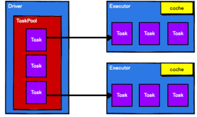

1: 执行原理
    
    从计算的角度来讲，数据处理过程中需要计算资源（内存 & CPU）和计算模型（逻辑）。执行时，需要将计算资源和计算模型进行协调和整合。
    Spark框架在执行时，先申请资源，然后将应用程序的数据处理逻辑分解成一个一个的计算任务。然后将任务发到已经分配资源的计算节点上, 
    按照指定的计算模型进行数据计算。最后得到计算结果。

    RDD是Spark框架中用于数据处理的核心模型，接下来我们看看，在Yarn环境中，RDD的工作原理:

    1: 启动Yarn集群环境
    

    2: Spark通过申请资源创建调度节点和计算节点

    3: Spark框架根据需求将计算逻辑根据分区划分成不同的任务

    4: 调度节点将任务根据计算节点状态发送到对应的计算节点进行计算

    从以上流程可以看出RDD在整个流程中主要用于将逻辑进行封装，并生成Task发送给Executor节点执行计算，接下来我们就一起看看Spark框架中RDD是具体是如何进行数据处理的。
