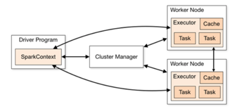
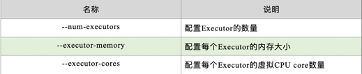

1: 运行架构
    
    Spark框架的核心是一个计算引擎，整体来说，它采用了标准 master-slave 的结构。
    如下图所示，它展示了一个 Spark执行时的基本结构。图形中的Driver表示master，负责管理整个集群中的作业任务调度。
    图形中的Executor 则是 slave，负责实际执行任务。

2: 

    由上图可以看出，对于Spark框架有两个核心组件：
    
    1: Driver
    
        Spark驱动器节点，用于执行Spark任务中的main方法，负责实际代码的执行工作。Driver在Spark作业执行时主要负责：

        将用户程序转化为作业（job）
        在Executor之间调度任务(task)
        跟踪Executor的执行情况
        通过UI展示查询运行情况
        实际上，我们无法准确地描述Driver的定义，因为在整个的编程过程中没有看到任何有关Driver的字眼。
        所以简单理解，所谓的Driver就是驱使整个应用运行起来的程序，也称之为Driver类。
    
    2: Executor

        Spark Executor是集群中工作节点（Worker）中的一个JVM进程，负责在 Spark 作业中运行具体任务（Task），任务彼此之间相互独立。
        Spark 应用启动时，Executor节点被同时启动，并且始终伴随着整个 Spark 应用的生命周期而存在。
        如果有Executor节点发生了故障或崩溃，Spark 应用也可以继续执行，会将出错节点上的任务调度到其他Executor节点上继续运行。

        Executor有两个核心功能：
        负责运行组成Spark应用的任务，并将结果返回给驱动器进程
        它们通过自身的块管理器（Block Manager）为用户程序中要求缓存的 RDD 提供内存式存储。
        RDD 是直接缓存在Executor进程内的，因此任务可以在运行时充分利用缓存数据加速运算。

    3: Master & Worker
        
        Spark集群的独立部署环境中，不需要依赖其他的资源调度框架，自身就实现了资源调度的功能，
        所以环境中还有其他两个核心组件：Master和Worker，这里的Master是一个进程，主要负责资源的调度和分配，
        并进行集群的监控等职责，类似于Yarn环境中的RM, 而Worker呢，也是进程，一个Worker运行在集群中的一台服务器上，
        由Master分配资源对数据进行并行的处理和计算，类似于Yarn环境中NM。

    4: ApplicationMaster

        Hadoop用户向YARN集群提交应用程序时,提交程序中应该包含ApplicationMaster，用于向资源调度器申请执行任务的资源容器Container，运行用户自己的程序任务job，监控整个任务的执行，跟踪整个任务的状态，处理任务失败等异常情况。
        说的简单点就是，ResourceManager（资源）和Driver（计算）之间的解耦合靠的就是ApplicationMaster。
    
    5:  Executor与Core
        
        Spark Executor是集群中运行在工作节点（Worker）中的一个JVM进程，是整个集群中的专门用于计算的节点。
        在提交应用中，可以提供参数指定计算节点的个数，以及对应的资源。这里的
        
        应用程序相关启动参数如下：

    6: 并行度（Parallelism）
            
        在分布式计算框架中一般都是多个任务同时执行，由于任务分布在不同的计算节点进行计算，所以能够真正地实现多任务并行执行，记住，这里是并行，而不是并发。
        这里我们将整个集群并行执行任务的数量称之为并行度。那么一个作业到底并行度是多少呢？这个取决于框架的默认配置。应用程序也可以在运行过程中动态修改。
    
    7: 有向无环图（DAG）
        
        大数据计算引擎框架我们根据使用方式的不同一般会分为四类，其中第一类就是Hadoop所承载的MapReduce,它将计算分为两个阶段，分别为 Map阶段 和 Reduce阶段。
        对于上层应用来说，就不得不想方设法去拆分算法，甚至于不得不在上层应用实现多个 Job 的串联，以完成一个完整的算法，例如迭代计算。 由于这样的弊端，催生了支持 DAG 框架的产生。
        因此，支持 DAG 的框架被划分为第二代计算引擎。如 Tez 以及更上层的 Oozie。这里我们不去细究各种 DAG 实现之间的区别，不过对于当时的 Tez 和 Oozie 来说，大多还是批处理的任务。
        接下来就是以 Spark 为代表的第三代的计算引擎。第三代计算引擎的特点主要是 Job 内部的 DAG 支持（不跨越 Job），以及实时计算。
        这里所谓的有向无环图，并不是真正意义的图形，而是由Spark程序直接映射成的数据流的高级抽象模型。简单理解就是将整个程序计算的执行过程用图形表示出来,这样更直观，更便于理解，可以用于表示程序的拓扑结构。
        DAG（Directed Acyclic Graph）有向无环图是由点和线组成的拓扑图形，该图形具有方向，不会闭环。
