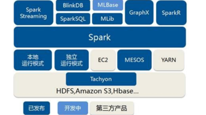
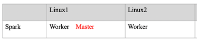
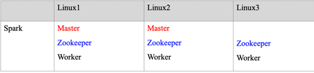
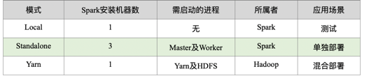

1: Spark作为一个数据处理框架和计算引擎，被设计在所有常见的集群环境中运行, 在国内工作中主流的环境为Yarn，
   不过逐渐容器式环境也慢慢流行起来。接下来，我们就分别看看不同环境下Spark的运行

   1: Local模式
        
      1: Local模式准备

      想啥呢，你之前一直在使用的模式可不是Local模式哟。所谓的Local模式，就是不需要其他任何节点资源就可以在本地执行Spark代码的环境，
      一般用于教学，调试，演示等，之前在IDEA中运行代码的环境我们称之为开发环境，不太一样。

      将spark-2.4.5-bin-without-hadoop-scala-2.12.tgz文件上传到Linux并解压缩，
      放置在指定位置，路径中不要包含中文或空格，课件后续如果涉及到解压缩操作，不再强调。
      
      wget https://archive.apache.org/dist/spark/spark-2.4.5/spark-2.4.5-bin-without-hadoop-scala-2.12.tgz
      tar -zxvf spark-2.4.5-bin-without-hadoop-scala-2.12.tgz
      mv spark-2.4.5-bin-without-hadoop-scala-2.12 spark-2.4.5-bin-without-hadoop-scala-2.12-local

      spark2.4.5默认不支持Hadoop3，可以采用多种不同的方式关联Hadoop3
         
         修改spark-local/conf/spark-env.sh文件，增加如下内容(需要启动hadoop)

            SPARK_DIST_CLASSPATH=$(/opt/module/hadoop3/bin/hadoop classpath)

         除了修改配置文件外，也可以直接引入对应的Jar包 (spark-hadoop3包下的)

      2：启动Local环境
         
         bin/spark-shell --master local[*]
      
         启动成功后，可以输入网址进行Web UI监控页面访问
         
         http://k8s-node1:4040
      
      3: 退出本地模式
         
         按键Ctrl+C或输入Scala指令 :quit

      4: 提交应用

         bin/spark-submit \
         --class org.apache.spark.examples.SparkPi \ (主类)
         --master local[2] \  (本地环境)
         ./examples/jars/spark-examples_2.12-2.4.5.jar \  (主类在哪里)
         10 (10个task)
            
         --class表示要执行程序的主类
         --master local[2] 部署模式，默认为本地模式，数字表示分配的虚拟CPU核数量
         spark-examples_2.12-2.4.5.jar 运行的应用类所在的jar包
         数字10表示程序的入口参数，用于设定当前应用的任务数量
   

   2: Standalone模式
      
      local本地模式毕竟只是用来进行练习演示的，真实工作中还是要将应用提交到对应的集群中去执行，
      这里我们来看看只使用Spark自身节点运行的集群模式，也就是我们所谓的独立部署（Standalone）模式。
      Spark的Standalone模式体现了经典的master-slave模式。

      集群规划:

      1：环境准备
      wget https://archive.apache.org/dist/spark/spark-2.4.5/spark-2.4.5-bin-without-hadoop-scala-2.12.tgz
      tar -zxvf spark-2.4.5-bin-without-hadoop-scala-2.12.tgz
      mv spark-2.4.5-bin-without-hadoop-scala-2.12 spark-2.4.5-bin-without-hadoop-scala-2.12-standalone
      
      
      spark2.4.5默认不支持Hadoop3，可以采用多种不同的方式关联Hadoop3
         
         修改spark-local/conf/spark-env.sh文件，增加如下内容(需要启动hadoop)

            SPARK_DIST_CLASSPATH=$(/opt/module/hadoop3/bin/hadoop classpath)

         除了修改配置文件外，也可以直接引入对应的Jar包 (spark-hadoop3包下的)
      
      2：修改配置文件
         
         1: 
            mv slaves.template slaves
            
            修改slaves文件，添加work节点
            k8s-node1
            k8s-node2
         
         2: 修改spark-env.sh.template文件名为spark-env.sh

             mv spark-env.sh.template spark-env.sh
             添加配置
             export JAVA_HOME=/software/jdk1.8.0_321
             SPARK_MASTER_HOST=k8s-noede1
             SPARK_MASTER_PORT=7077

             注意：7077端口，相当于hadoop3内部通信的8020端口

         3: 启动集群
            
            执行脚本命令：

            sbin/start-all.sh

         4: 查看Master资源监控Web UI界面: http://k8s-node1:8080 

         5: 提交应用

            bin/spark-submit --class org.apache.spark.examples.SparkPi --master spark://k8s-node1:7077 ./examples/jars/spark-examples_2.12-2.4.5.jar 10

            --class表示要执行程序的主类
            --master spark://k8s-node1:7077 独立部署模式，连接到Spark集群
            spark-examples_2.12-2.4.5.jar 运行类所在的jar包
            数字10表示程序的入口参数，用于设定当前应用的任务数量
         
         6:  配置历史服务
            
            由于spark-shell停止掉后，集群监控k8s-node1:4040页面就看不到历史任务的运行情况，所以开发时都配置历史服务器记录任务运行情况。
            
            1:
            修改spark-defaults.conf.template文件名为spark-defaults.conf
            mv spark-defaults.conf.template spark-defaults.conf
            
            2:
            修改spark-default.conf文件，配置日志存储路径
            spark.eventLog.enabled          true
            spark.eventLog.dir               hdfs://k8s-node1:8020/directory
            注意：需要启动hadoop集群，HDFS上的directory目录需要提前存在。

            sbin/start-dfs.sh
            hadoop fs -mkdir /directory
            
            3:
            修改spark-env.sh文件, 添加日志配置
            export SPARK_HISTORY_OPTS="
            -Dspark.history.ui.port=18080
            -Dspark.history.fs.logDirectory=hdfs://k8s-node1:8020/directory
            -Dspark.history.retainedApplications=30"

            参数1含义：WEBUI访问的端口号为18080
            参数2含义：指定历史服务器日志存储路径
            参数3含义：指定保存Application历史记录的个数，如果超过这个值，旧的应用程序信息将被删除，这个是内存中的应用数，而不是页面上显示的应用数。
            
            4: 分发配置文件
            xsync conf 
            
            5: 重新执行任务
            
            bin/spark-submit --class org.apache.spark.examples.SparkPi --master spark://k8s-node1:7077 ./examples/jars/spark-examples_2.12-2.4.5.jar 10
               
            6: 查看历史服务：http://k8s-node1:18080
         
         7: 高可用配置
               
            所谓的高可用是因为当前集群中的Master节点只有一个，所以会存在单点故障问题。所以为了解决单点故障问题，
            需要在集群中配置多个Master节点，一旦处于活动状态的Master发生故障时，由备用Master提供服务，
            保证作业可以继续执行。这里的高可用一般采用Zookeeper设置
            
            集群规划

            
            1：停止集群
               sh sbin/stop-all.sh 

            2: 启动zk
            
            3: 修改spark-env.sh文件添加如下配置
               
               注释如下内容：
               #SPARK_MASTER_HOST=linux1
               #SPARK_MASTER_PORT=7077
               SPARK_MASTER_WEBUI_PORT=8989
               
               添加如下内容:
                  export SPARK_DAEMON_JAVA_OPTS="
                  -Dspark.deploy.recoveryMode=ZOOKEEPER
                  -Dspark.deploy.zookeeper.url=k8s-node1
                  -Dspark.deploy.zookeeper.dir=/spark"
               
            4: 分发配置文件
               
               xsync conf/ 
            
            5: 启动集群
         
               sbin/start-all.sh 

            6: 启动linux2的单独Master节点，此时linux2节点Master状态处于备用状态

               sbin/start-master.sh 
            
            7: 提交应用到高可用集群
               
               bin/spark-submit --class org.apache.spark.examples.SparkPi --master spark://k8s-node1:7077,k8s-node2:7077 --deploy-mode cluster ./examples/jars/spark-examples_2.12-2.4.5.jar 10

            8: 停止k8s-node1的Master资源监控进程
            
            9: 查看k8s-node2的Master 资源监控Web UI，稍等一段时间后，k8s-node2节点的Master状态提升为活动状态

   3: Yarn模式
      
      独立部署（Standalone）模式由Spark自身提供计算资源，无需其他框架提供资源。这种方式降低了和其他第三方资源框架的耦合性，独立性非常强。
      但是你也要记住，Spark主要是计算框架，而不是资源调度框架，所以本身提供的资源调度并不是它的强项，所以还是和其他专业的资源调度框架集成会更靠谱一些。
      所以接下来我们来学习在强大的Yarn环境下Spark是如何工作的（其实是因为在国内工作中，Yarn使用的非常多）。

      1：环境准备
      wget https://archive.apache.org/dist/spark/spark-2.4.5/spark-2.4.5-bin-without-hadoop-scala-2.12.tgz
      tar -zxvf spark-2.4.5-bin-without-hadoop-scala-2.12.tgz
      mv spark-2.4.5-bin-without-hadoop-scala-2.12 spark-2.4.5-bin-without-hadoop-scala-2.12-yarn
      
      
      spark2.4.5默认不支持Hadoop3，可以采用多种不同的方式关联Hadoop3
         
         修改spark-local/conf/spark-env.sh文件，增加如下内容(需要启动hadoop)

            SPARK_DIST_CLASSPATH=$(/opt/module/hadoop3/bin/hadoop classpath)

         除了修改配置文件外，也可以直接引入对应的Jar包 (spark-hadoop3包下的)

      2: 修改配置文件

         1: 修改hadoop配置文件/opt/module/hadoop/etc/hadoop/yarn-site.xml, 并分发

         <!--是否启动一个线程检查每个任务正使用的物理内存量，如果任务超出分配值，则直接将其杀掉，默认是true -->
         <property>
              <name>yarn.nodemanager.pmem-check-enabled</name>
              <value>false</value>
         </property>
         
         <!--是否启动一个线程检查每个任务正使用的虚拟内存量，如果任务超出分配值，则直接将其杀掉，默认是true -->
         <property>
              <name>yarn.nodemanager.vmem-check-enabled</name>
              <value>false</value>
         </property>
         
         2: 修改conf/spark-env.sh，添加JAVA_HOME和YARN_CONF_DIR配置

            mv spark-env.sh.template spark-env.sh
            。。。
            export JAVA_HOME=/opt/module/jdk1.8.0_144
            YARN_CONF_DIR=/opt/module/hadoop/etc/hadoop
            
            分发配置

         3:  启动HDFS以及YARN集群

         4: 提交应用

            bin/spark-submit --class org.apache.spark.examples.SparkPi --master yarn ./examples/jars/spark-examples_2.12-2.4.5.jar 10

         
         5:  配置历史服务
            
            由于spark-shell停止掉后，集群监控k8s-node1:4040页面就看不到历史任务的运行情况，所以开发时都配置历史服务器记录任务运行情况。
            
            1:
            修改spark-defaults.conf.template文件名为spark-defaults.conf
            mv spark-defaults.conf.template spark-defaults.conf
            
            2:
            修改spark-default.conf文件，配置日志存储路径
            spark.eventLog.enabled          true
            spark.eventLog.dir               hdfs://k8s-node1:8020/directory
            注意：需要启动hadoop集群，HDFS上的directory目录需要提前存在。

            sbin/start-dfs.sh
            hadoop fs -mkdir /directory
            
            3:
            修改spark-env.sh文件, 添加日志配置
            export SPARK_HISTORY_OPTS="
            -Dspark.history.ui.port=18080
            -Dspark.history.fs.logDirectory=hdfs://k8s-node1:8020/directory
            -Dspark.history.retainedApplications=30"

            参数1含义：WEBUI访问的端口号为18080
            参数2含义：指定历史服务器日志存储路径
            参数3含义：指定保存Application历史记录的个数，如果超过这个值，旧的应用程序信息将被删除，这个是内存中的应用数，而不是页面上显示的应用数。
            
            4: 修改spark-defaults.conf
               
               spark.yarn.historyServer.address=k8s-node1:18080
               spark.history.ui.port=18080
               
            5: 分发配置文件
            xsync conf 
            
            6: 重新执行任务
            
            bin/spark-submit --class org.apache.spark.examples.SparkPi --master yarn ./examples/jars/spark-examples_2.12-2.4.5.jar 10

   4: 部署模式对比

   5: 端口号

       Spark查看当前Spark-shell运行任务情况端口号：4040（计算）
       Spark Master内部通信服务端口号：7077
       Standalone模式下，Spark Master Web端口号：8080（资源）
       Spark历史服务器端口号：18080
       Hadoop YARN任务运行情况查看端口号：8088
