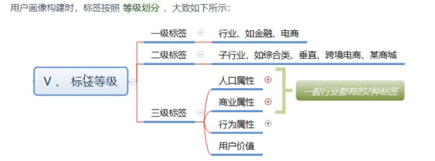

1、基础标签 Tag页

2、基础标签 分类
    
    按照标签体系划分标签4级 ，5级标签
    - 4级标签：业务标签
    - 5级标签：业务标签对应的值（属性标签）
    
3、标签分类
    
    在用户画像项目中，将标签按照级别进行划分的，总共划分为5个级别标签
    1级，2级，3级 主分类标签
    4级 业务标签
    5级 属性标签
    
    如下图：

    
    以上【性别标签】为例，说明标签级别划分：
    1）、【性别】标签
         业务标签，4级标签
        4级业务标签
    2）、【性别】标签对应属性值：男，女
         【男】，【女】为属性标签，5级标签
          5级属性标签
    3）、【性别】标签属于分类，称为主分类标签，1，2，3级标签
          主分类标签会分为3级呢？？

4、创建业务标签
    
    具体业务标签，其中有很多相关设置，关于标签如何构建（读取数据源，运行Spark程序及调度策略）
    

    业务标签参数具体说明

5、针对业务标签操作
    
    - 启动：业务标签运行程序生成标签
    - 编辑：修改业务标签属性
    - 删除：将业务标签删除

6、新建：5级标签
    
    每个业务标签（4级标签）对应的值称之为5级标签（属性标签），所以在新建业务标签（4级标签）以后，需要在其下面新建具体的值(5级标签)，如下图：

    
    具体操作：

7、实际开发标签模型应用时，在确定标签业务需求后，首先要在标签管理中注册创建标签：
    
    第一步，创建业务标签（4级标签）：标签
        比如性别标签，其中填写标签信息和标签对应模型信息数据
    第二步，创建属性标签（5级标签）：属性值
        比如针对性别标签，属性值：男，女，创建2个5级标签
    