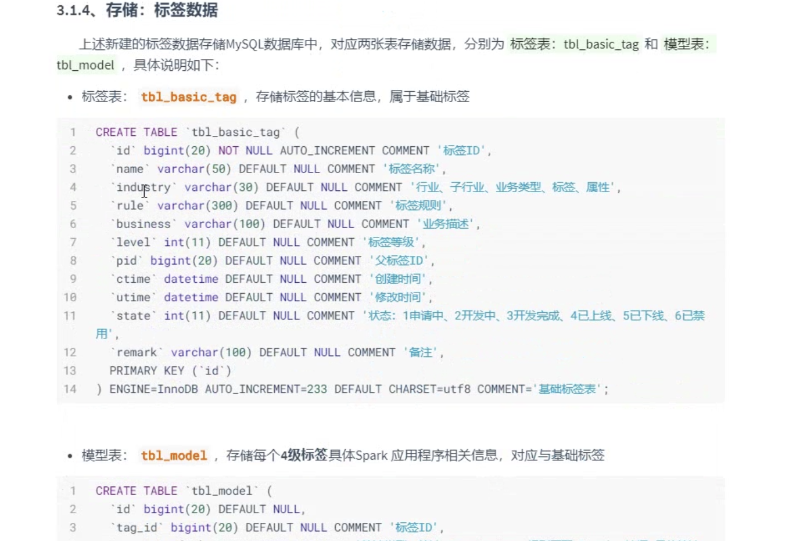
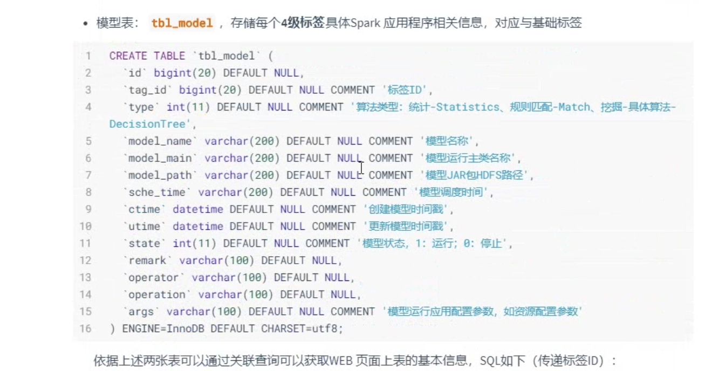
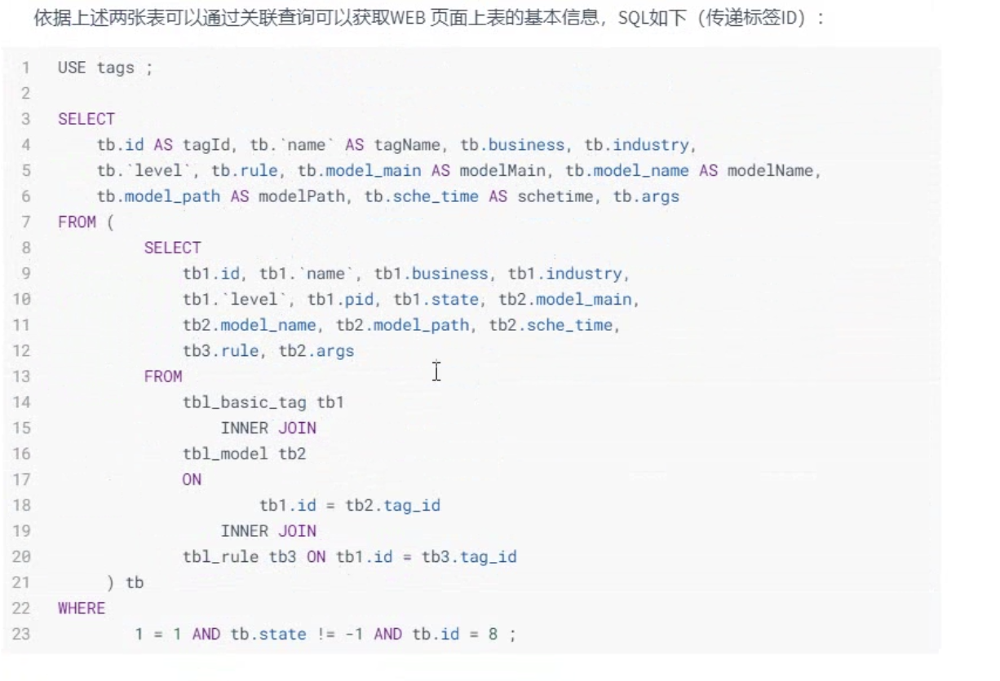

针对整个用户画像系统来说，将用户数据进行标签化，给每个用户打上标签，涉及数据有两类：

第一类数据：标签元数据MataData

    存储标签的基本信息数据，比如每个标签名称，标签的值，标签的级别

    标签ID              标签名称            标签级别
    1                   性别               4
    2                   男                 5
    3                   女                 5

第二类数据：用户画像标签

    存储HBase表： tbl_profile
    行主键        列族名        字段名             字段值
    1             user        agerange          90后
    1             user        consumercycle     近4月
    1             user        gender            女
    1             user        job               学生
    1             user        politicalface     群众
    1             user        nationality       群众
    1             user        paymentcode       支付宝
    1             user        rfm               中下价值
    1             user        rfe               活跃
    1             user        psm               不太敏感
    1             user        usg               男

    存储Elasticsearch: tag_index
    {
        "_index": "tags_index",
        "_type": "tags",
        "_id": "897",
        "_version": 11,
        "_score": 1,
        "_source": {
            "gender": "女",
            "job": "学生",
            "politicalface": "群众",
            "nationality": "中国大陆",
            "agerange": "80后",
            "consumercyle": "近4月",
            "paymentcode": "支付宝",
            "rfm": "中下价值",
            "rfe": "活跃",
            "psm": "不太敏感",
            "usg": "男"

        }
    }
