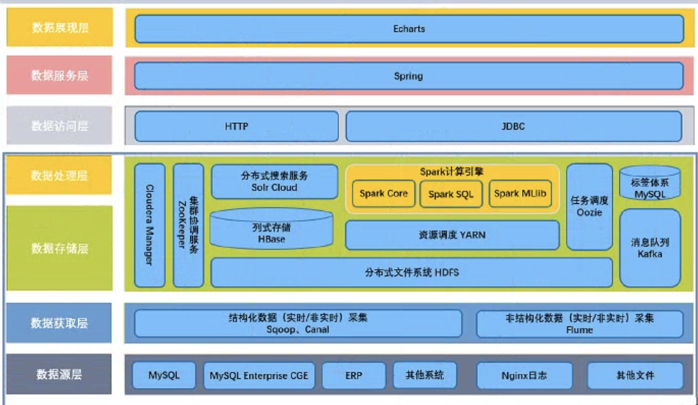

1: 数据源层

      MYSQL数据库表，日志文件

2: 数据存储层

    采集工具：Sqoop, Flume, Canal

3: 数据分析层

   主要使用SparkSQL,SparkMLib构建用户标签
   标签数据存储：HBase Solr/ES

4: 标签元数据

   主要管理整个用户画像平台有哪些标签，标签的基本信息
   存储MySQL表中

5: 每个标签开发完成以后，每个一段时间运行应用程序，给用户打上标签值
   使用Oozie中Coordinator调度器

   