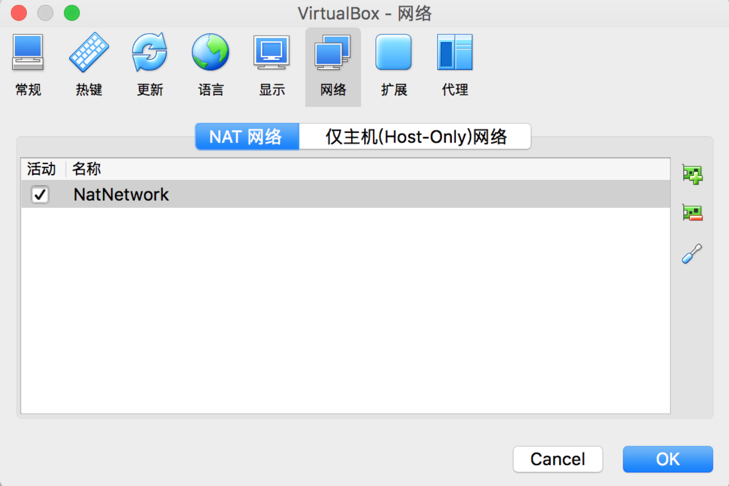

1) 进入virtualbox -> 偏好设置

    

2) 切换到网络Tab页，新建一个NAT网络

   

3) 在新建的NAT网络上面点击右键，选择编辑，并记下网关地址，这里的网关地址是10.0.2.0
   
   

4) 更改虚拟机的网络设置，并选择刚才新建的NAT网络
   
   

5) 修改虚拟机网络配置 

         使用管理员用户进入/etc/sysconfig/network-scripts目录，可以看到一个ifcfg-xxx的文件。其中xxx是网卡的名称，在每台机器上不同。编辑这个文件，需要修改的内容为：

         BOOTPROTO=static   #从dhcp改成静态
      
         IPONBOOT=yes             #设置开机自动生效#以下内容为新增
      
         IPADDR=10.0.2.8        #为自己的虚拟机再10.0.2.x这个网段里设置一个静态IP
      
         GATEWAY=10.0.2.1
      
         NETMASK=255.255.255.0
      
         DNS1=10.0.2.1

         编辑完成后保存退出，重启网络服务：

         service network restart

         
6) 完成配置 

         此时可以通过 ip addr 命令查看本机的IP的地址

 

但是这种配置，本机和虚拟机不在一个网段，不能互通，不要通过转发才行，下面我们使用另外一种方式，虚拟机和本机可以互通，虚拟机和外网可以互通，虚拟机之间可以互通

7) 点击工具，选择网络，创建新的网卡

   

8) 在虚拟机上设置网络，设置两张网卡，一张是nat网络，用于连接外部网络。另一个是host-only网络，使用的是之前配置好的vboxnet设置
   
   
   

       这两张网卡可以确保虚拟机可以连接外网，同时可以在mac使用ssh也可以直接连接虚拟机

9) 设置虚拟机网卡

    1) enp0s3 设置为dhcp
    2) enp0s8 设置为static，此时可能没有enp0s8，需要copy enp0s3为enp0s8，并修改NAME,DEVICE为enp0s8
       UUID使用uuidgen 命令生成一个，然后再设置固定ip

       IPADDRO=192.168.56.101
       GATWAYO=192.168.56.1
       DNS1=192.168.56.1